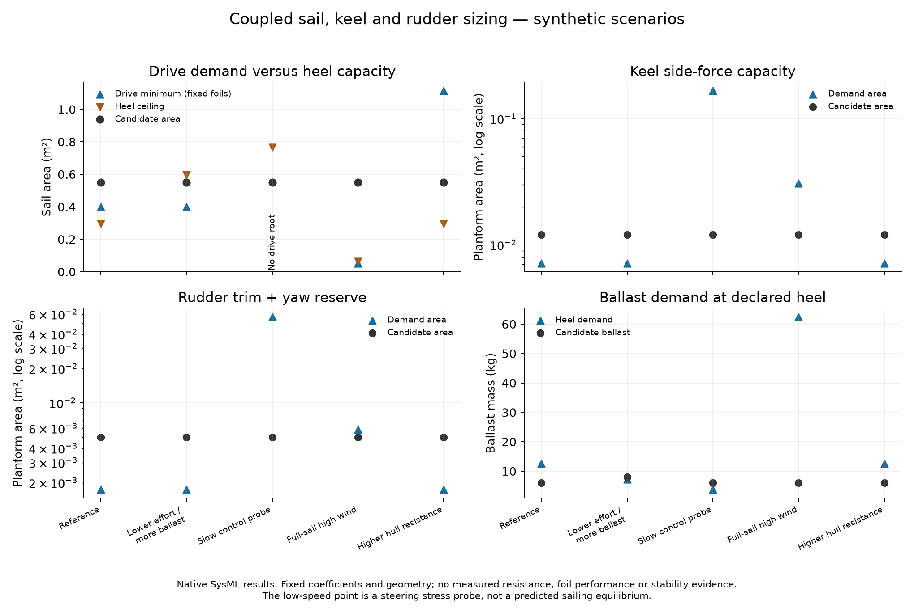
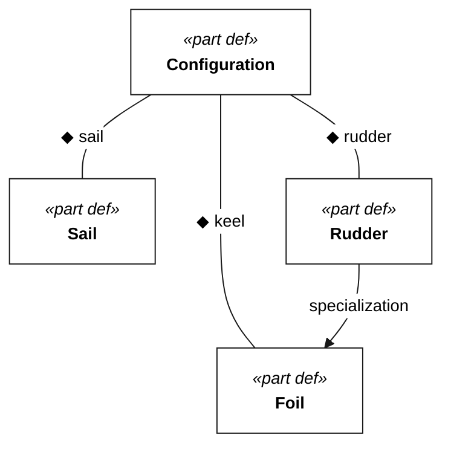

# Sizing the sail, keel and rudder together

The [required-polar study](sailing-performance.md) tells us the water speed we need. This study asks whether a candidate sail can supply enough drive at that speed, whether its side force can be carried by the keel and rudder, and whether the boat can resist the resulting heel. These are coupled choices: increasing sail area can fix a drive deficit while making stability and steering worse.

The executable source is [appendage-sizing.sysml](../models/appendage-sizing.sysml). The [native results](appendage-sizing-results.md) contain current inputs, dimensions, loads and individual gates; [machine-readable results](analysis/appendage-sizing.json) are generated alongside them. Examples describe a future challenge-vessel sizing exercise, not the separate manufacturing prototype CAD.



The [coupled design search](design-search.md) now extends this prescribed-resistance screen by solving geometry, mass, draft, trim and estimated resistance together.

## What the first cases tell us

The reference takes clean boat speed, true wind and heading directly from the upstream headwind polar-demand case. Hull resistance, sail coefficients, geometry, mass allowance and load factors are illustrative inputs. They are not new requirements or measurements.

The reference has enough modeled drive, but its drive-area minimum exceeds its heel-area ceiling. A second case lowers the center of effort and increases ballast; it passes the numerical screens under the same assumed resistance. That is a promising direction to investigate, not proof of a feasible hull: changing ballast changes displacement, wetted surface, resistance and the righting-arm curve, which must be recomputed.

The slow-control probe fails foil capacity even though it has less sail side force. Local water speed falls, so the dynamic pressure available to generate steering and lateral force falls sharply. The full-sail high-wind case instead exposes heel and appendage load limits. These point toward sail depowering and an explicit minimum controllable-speed envelope, rather than simply enlarging everything.

## Sail: drive and heel define an interval

For the initial upwind screen, water-relative true wind is converted to apparent wind using **boat speed**, not ground speed or VMG. Leeway is neglected in this kinematic conversion. With apparent-wind angle `alpha`, dynamic pressure `qa`, whole-sail coefficients `CL` and `CD`, and area `A`:

```text
sail drive      = qa A (CL sin(alpha) - CD cos(alpha))
sail side force = qa A (CL cos(alpha) + CD sin(alpha))
```

Coefficients must represent the actual wing or soft sail, trim, heel and Reynolds number. No fixed coefficient is assumed to remain valid across the mission. Lift scales with dynamic pressure and area, but its coefficient must be established at applicable flow conditions. [NASA lift coefficient](https://www1.grc.nasa.gov/beginners-guide-to-aeronautics/lift-coefficient-2/)

The required drive includes supplied **hull-only** resistance plus the candidate foils' profile and induced drag. Do not enter a total tow resistance that already includes those appendages. At fixed foil geometry, side load grows with sail area and induced drag grows with its square. The model solves the resulting quadratic for a drive-feasible area interval; a negative discriminant means no solution under those assumptions. A zero-area sentinel when `driveSolutionExists` is false is not a design result. Roots beyond the coefficient and geometry evidence envelope have no demonstrated physical validity.

Heel adds a separate maximum sail area using the declared righting moment, effective vertical separation of air and water side forces, and load factor. The drive/heel interval is only one screen; foil capacity, actuator torque and mass must also pass. Changing area requires rerunning the complete case.

A full VPP balances drive/resistance and heel/righting while updating the sailing condition. This model is an inverse sizing screen at a prescribed speed, not that solver. [ORC VPP methodology](https://orc.org/organization/velocity-prediction-program-vpp)

## Keel and rudder: force and yaw balance

The keel's lateral center is the longitudinal origin, positive forward. The rudder arm is aft and negative. With sail side force `Y`, sail center `xs`, and rudder arm `xr`:

```text
rudder trim force = Y xs / xr
keel trim force   = Y - rudder trim force
reserve force     = yaw-moment reserve / abs(xr)
minimum foil area = load factor × (abs(trim force) + reserve force)
                    / (local water dynamic pressure × allowable CL)
```

The signed trim matters: a forward sail center can require reverse rudder load and greater keel load. The additional force reserve allows corrective yaw in either direction, with the keel carrying the compensating force. It is an assumed authority budget, not a predicted turn radius, tack success or avoidance maneuver.

Center-of-effort height, foil span and ballast lever are independent sizing inputs; no package geometry is implied. Reconcile them with a buildable sail plan and keel arrangement before accepting a candidate.

Area means single planform area, not wetted area. Span and area produce mean chord and aspect ratio. Profile drag and finite-span induced drag are included at steady trim; the extra maneuver reserve is a capacity check, not drag continuously charged to passage speed. The induced-drag approximation uses `CDi = CL²/(pi e AR)`, with declared span efficiency. [NASA induced drag](https://www1.grc.nasa.gov/beginners-guide-to-aeronautics/induced-drag-coefficient/)

Reynolds numbers are reported for all three surfaces. The allowable foil coefficients are capacity assumptions; the model does not derive lift from leeway or rudder angle. Free-surface effects, hull endplates, sweep, heel, stall, ventilation and weed accumulation require applicable foil data. This matters especially for the low-speed probe, where extrapolating clean coefficients is weakest.

The rudder screen reports actuator torque for both trim-plus-reserve demand and the assumed coefficient envelope at the case's local flow. Hinge offset, friction and torque margin are explicit. Neither is a servo selection until pressure-center movement, gearing, stall/jam loads, maximum-speed cases and duty cycle are evaluated. Foil root side moments use a midpoint load arm; they exclude ballast weight, impacts and joint strength.

## Ballast is not the whole keel design

The model separates side-force area from ballast. Its incremental ballast estimate uses submerged effective weight, a fixed lever and the sine of the declared heel, added to a supplied baseline righting moment that excludes that ballast increment. The mass screen includes ballast plus all other mass.

This is a preliminary sensitivity model. A loaded-hull hydrostatic model must replace the fixed baseline and lever before choosing ballast: buoyancy distribution and the center of gravity change with loading and heel. A successful single-angle check does not establish positive stability, capsize recovery or compliance with the self-righting requirement.

## Model structure and next measurements

<!-- diagram:sizing-integration -->

<!-- /diagram -->

The candidate configuration owns its sail, keel and rudder geometry. Model dependencies connect the analysis to the polar study, cruise evidence, weed tolerance, self-righting and logical architecture; these dependencies do not claim requirement verification.

The next useful inputs are a resistance curve for a declared loaded hull; sail force data across trim and apparent wind; keel/rudder lift, drag and hinge-moment data at the reported Reynolds numbers; and loaded righting-arm curves. Then sweep operating speed, wind, reef/depower state and center-of-effort position together. Weed-shedding geometry and the 250 mm printer build volume constrain construction, but neither follows from area alone. Printer-sized modules can form a larger assembled surface; their joints still need structural assessment.

Regenerate everything with `uv run python scripts/render_requirements.py`; run the executable sizing checks with `uv run pytest tests/test_appendage_sizing.py`. Figures plot native outputs and do not contain a second implementation of the sizing equations.
