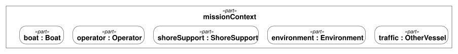
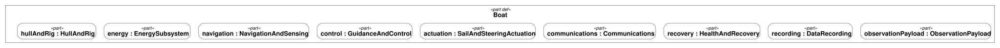

# SV Blue Dog logical architecture

## Mission context

## Boat subsystems

These native OpenSysML views show the parts already declared in
[blue-dog.sysml](../models/blue-dog.sysml). They describe logical responsibilities
shared by the Gorge and Hawaii missions, not selected circuit boards.
The observation payload is optional (`[0..1]` in the model); the native diagram
currently omits that multiplicity label.

Ports, power/data connections, and behavior allocations have not yet been
modeled, so the diagrams show containment without invented interface lines.
The context boat is typed by the Boat definition shown in the subsystem view.

The views are defined in [architecture-view.sysml](../models/architecture-view.sysml).
Regenerate both diagrams, the requirement diagram, and the register with
`uv run python scripts/render_requirements.py`. Native DOT, SVG, and PNG are
committed in `docs/figures/`; `--check` checks the DOT and register for freshness.
