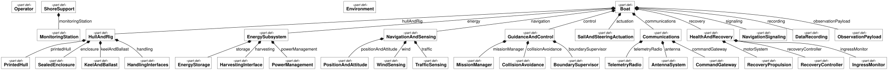
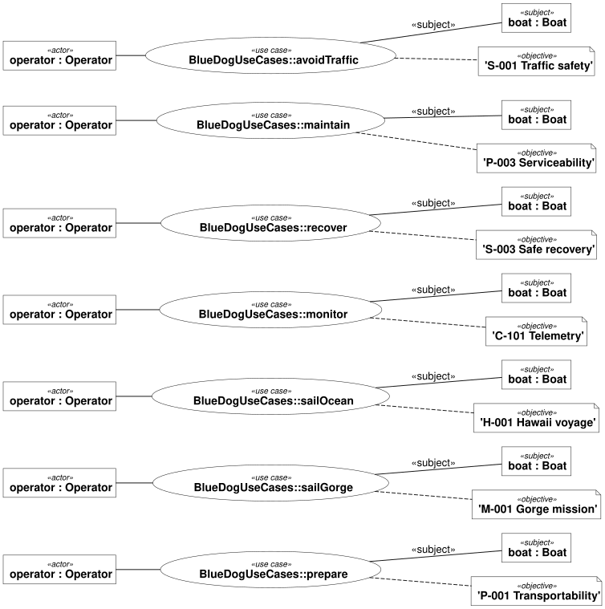

# SV Blue Dog logical architecture

The SVG and PNG files are regenerated by `scripts/render_requirements.py` on every
normal run. GitHub/raw image previews can cache an older revision; use a
commit-specific URL when comparing images.

## Mission context

## Boat definition and composition

The boat view uses native definition-diagram rendering: composition links have
filled diamonds at Boat and labels naming its parts. This is the SysML v2
equivalent of the requested BDD-style presentation. The context view retains
its nested parts. Both views show the model already declared in
[blue-dog.sysml](../models/blue-dog.sysml). They describe logical responsibilities
shared by the Gorge and Hawaii missions, not selected circuit boards.
The observation payload is optional (`[0..1]` in the model); the native diagram
currently omits that multiplicity label.

## Detailed composition

The model now separates printed hull and seals, handling interfaces, energy
storage and management, position/wind/traffic sensing, mission and collision
control, telemetry/command equipment, and powered recovery. Navigation signaling
is a separate logical responsibility. Equipment makes, dimensions, and budgets
remain open.

## Use cases and requirements

The use cases cover preparation, Gorge and Hawaii sailing, live monitoring,
collision avoidance, manufacturing/service, and abort/recovery. Each objective
subsets an existing requirement usage; its ID is shown in the diagram.
Actor participation represents stakeholder involvement, not permission to guide
a qualifying voyage remotely.

[Native traceability tables](traceability.md) connect use-case objectives to
requirements and requirements to candidate design elements through SysML
`satisfy` relationships. These are design assertions awaiting evidence, not
verification results. Unallocated regulatory classification is deliberately
visible as a gap: it requires a project-level review.

[Operating constraints and regulatory sources](operating-constraints.md) explain
why no unattended-buoy size exemption has been assumed.

Ports and power/data connections have not yet been modeled; composition links
are not interfaces.
The context boat is typed by the Boat definition shown in the subsystem view.

The views are defined in [architecture-view.sysml](../models/architecture-view.sysml).
Regenerate both diagrams, the requirement diagram, and the register with
`uv run python scripts/render_requirements.py`. Native DOT, SVG, and PNG are
committed in `docs/figures/`; `--check` checks the DOT and register for freshness.

## External traffic

The context includes zero or more `OtherVessel` instances: commercial ships, barges and recreational/fishing craft, including non-AIS traffic. These are external participants, not onboard components or controllable resources. Voyage and recovery use cases include traffic; collision avoidance links to S-001 and presentation of navigation signals links to S-004. The operator actor does not imply intervention is required during a qualifying attempt. Encounter geometry and sensor performance remain to be decomposed.

Environmental qualification targets are specified in N-001 through N-003; see [envelope and acceptance criteria](environmental-envelope.md).
