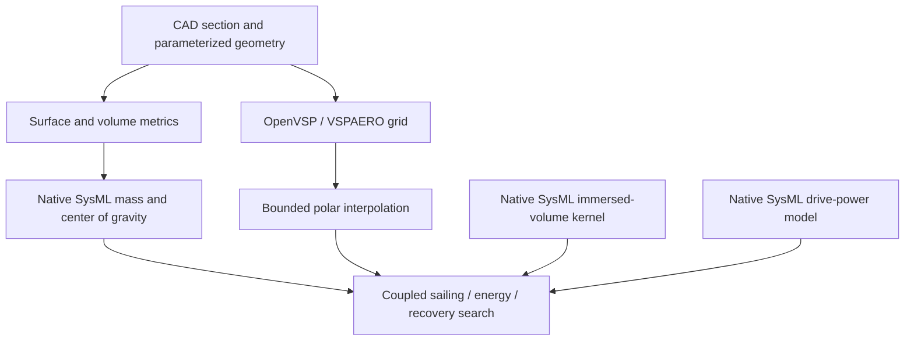

# Coupled sizing inputs

<!-- Generated by scripts.publish_coupled_inputs. -->

**Reference inputs, not the optimized candidate.** The coupled search and sensitivity studies are reported in [coupled results](coupled-results.md). The reference geometry uses the previous two-metre dimensions with recomputed skin/rib mass and centroids. It is not a newly feasible design.

## Geometry and mass

Calculated mass: **33.10 kg**. Center of gravity: (-0.0124, 0.0042, -0.1216) m in the hull reference frame. The reference plane is not the solved waterline.

| Component | Calculated mass (kg) |
|---|---:|
| Hull | 8.188 |
| Wing | 4.505 |
| Keel structure | 3.122 |
| Rudder structure | 0.042 |
| Battery | 1.482 |
| Solar panel | 0.462 |
| Wing drive | 0.321 |
| Rudder drive | 0.201 |
| Equipment/attachments | 3.100 |
| Ballast | 11.674 |

External mesh faces supply skin area; closed volumes supply diaphragm-rib allocations. Native SysML accounts for printed substrate, glass, resin, finish, seam tape and equipment. Thin-wall section properties use the actual reference section, rather than a generic wing thickness. Manufacturing properties and equipment mass scaling are provisional.

The reference wing is a rectangular extrusion of the CAD midsection. Camber, thickness, aspect ratio, area and mast position are independent geometry inputs. The hull is an elliptical-planform sizing family. Keel and rudder use a 12%-thick elliptic section family; section-shape optimization is not implemented.

The volume-normalized 3:1:1 bulb sits immediately below the keel tip without overlap; its joint still needs structural detailing. Seam/finish mass is included but its displacement is omitted. Flooding, retained water and trim-dependent wing centroid are not yet part of this mass replay.

## VSPAERO response surface

The saved grid contains 12 aspect/camber combinations, each with eight incidence points: aspect ratios 2, 4, 6 and 8; camber scales 0.5, 1 and 1.5; incidence −12° through 16°. Camber scale 1 reproduces the extracted reference mean line. The mesh setting is 24; reference mesh sensitivity is documented [separately](wing-analysis-results.md).

Interpolation returns lift, induced drag and pitching moment about midchord. It rejects out-of-range or nonfinite requests. Profile drag, stall limits and uncertainty factors remain separate engineering inputs; they are not VSPAERO predictions. Thickness is fixed in the grid, and no aerodynamic thickness sensitivity has been established.

The additional zero-camber case passes the zero-incidence lift/moment symmetry check. Twelve reversed-chord counterparts support an end-for-end transformation for the opposite tack, with lift and moment signs reflected consistently. These inviscid computations still do not validate rounded-edge separation, viscous behavior or square-sail mode.

## Execution boundary

Detailed inputs and provenance: [mass replay](analysis/coupled-mass-reference.json), [VSPAERO grid](analysis/wing-polar-grid.json), [SysML model](../models/coupled-sizing.sysml). See the [workflow](coupled-sizing.md) for the remaining acceptance gates.
