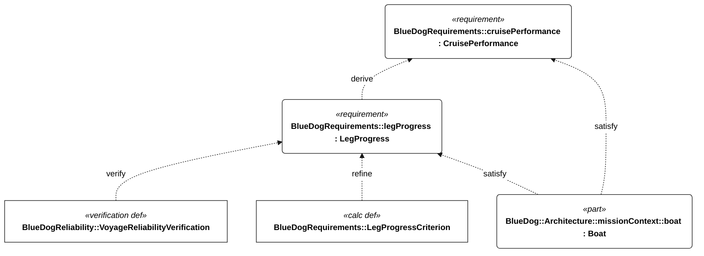
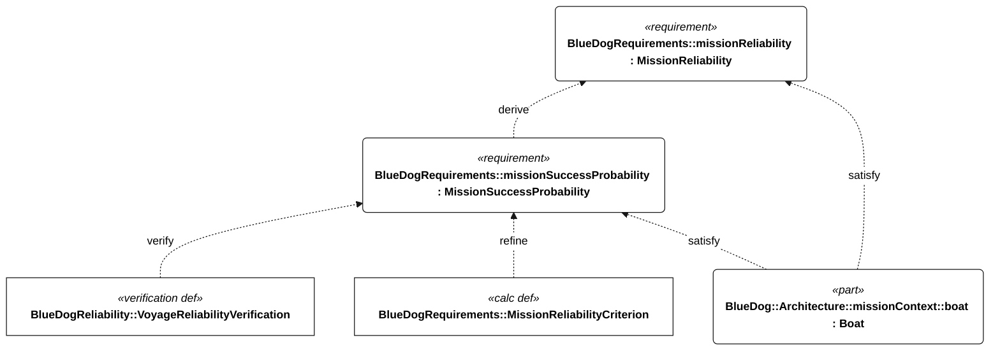

# Cruise speed, exposure and reliability

A slower boat must keep working longer. Current, tacking, weeds and time waiting for usable wind can matter more than a favorable straight-line speed. This analysis connects the [cruise requirements](figures/requirements-q-001.md) to [mission reliability](figures/requirements-l-001.md) and the [architecture DFMEA](dfmea.md).

Numerical targets and acceptance conditions are maintained in the linked requirements and [context report](requirements-context.md).

## Requirement relationships

The calculations refine numerical acceptance, while the verification case evaluates the requirements using accepted evidence. Intended satisfaction by the boat is a separate design relationship. The calculation alone does not establish mission-profile suitability.

<!-- diagram:cruise-semantics -->

<!-- /diagram -->

<!-- diagram:reliability-semantics -->

<!-- /diagram -->

The [polar and hull-speed study](sailing-performance.md) now computes candidate water VMG from sailing angles and speed, then feeds it into this exposure model.

## Native analysis

[cruise-reliability.sysml](../models/cruise-reliability.sysml) defines `CruiseReliability`, with typed distances, speeds and durations. It executes these relationships:

- Ground velocity made good = water-relative VMG × retained-performance factor + signed along-route current.
- Elapsed exposure = sum of leg distance / ground VMG + weather holds and maneuvering time.
- Constant-hazard reliability = exp(−combined critical failure rate × exposure).
- Allowed critical failure rate = −ln(required reliability) / exposure hours.
- Required zero-failure test exposure = −ln(1 − confidence) / allowed failure rate.

Water VMG must already account for heading and tacking. A polar solver is not implemented. The retained-performance factor represents a declared degradation allowance, such as fouling; it must not double-count losses already in measured VMG. Nonpositive ground progress is infeasible, not a zero-duration passage. Waiting belongs in exposure even while propulsion demand is low.

These constant-hazard and zero-failure relationships follow the [NIST exponential reliability model](https://itl.nist.gov/div898/handbook/apr/section1/apr161.htm) and [one-sided zero-failure confidence bound](https://www.itl.nist.gov/div898/handbook/apr/section4/apr451.htm). `exp` and `ln` use the bundled non-normative `OpenSysMLMathFunctions` library; the model and constraints remain SysML.

## Published results

Read the [generated results](cruise-reliability-results.md) and [native analysis JSON](analysis/cruise-reliability.json) for the current synthetic profile. Assumed distances, VMG, current, degradation, holds and test exposure are not surveyed gates, a measured polar or actual reliability evidence.

Lower VMG and longer holds tighten the failure-rate budget. Hawaii needs its own declared profile. With positive critical hazard, survival probability declines with exposure; a finite calculation cannot establish indefinite operation.

## Evidence and boundaries

The model distinguishes a numerical estimate from a confidence-qualified claim. Both the rate-budget check and zero-failure demonstration must pass, using accepted profile, rate and constant-hazard evidence. Observing a critical failure invalidates the zero-failure method; another statistical method is then needed. Missing rates are errors, not zeros. Individual component confidence bounds need a joint-confidence argument before combination.

The failure-rate sum assumes independent, non-overlapping random critical modes, plus an explicit common-cause term. It does not establish wear-out life, systematic software reliability, weather availability, repairability or hazard acceptability. The initial DFMEA deliberately assigns no probabilities or RPNs. Passing a reliability budget does not disposition a safety-critical mode.

Qualified autonomous duration is an evidence input. A dependency links this analysis to `BlueDogEnergy::SustainedOperation`, but no energy campaign is automatically stretched to match the voyage. Run an energy campaign covering the full cruise-derived exposure, with a matching configuration, weather/hold profile and recovery reserve, before accepting that duration. Longer waits may improve harvest while still increasing failure exposure.

## Architecture DFMEA

[dfmea.sysml](../models/dfmea.sysml) defines the reusable `FailureMode`, `Review` and `DesignFailureReview` elements. Starter modes reference actual architecture parts, with native dependencies to affected requirements. Each records function, cause, local and mission effects, proposed detection, action, owner role and evidence state. `RiskMetadata::Risk` is present without invented probability scores.

The [native review output](analysis/dfmea.json) reports open actions, unresolved critical dispositions and scope readiness. Its inventory objective checks that rows exist; `reviewReady` is a separate result. Completing listed rows does not prove exhaustive hazard coverage.

Next steps are to freeze a candidate sailing profile, measure a loaded-vessel polar and weed degradation, review the DFMEA against interfaces and mission phases, and turn prioritized actions into fault-injection/qualification evidence.

## Run and inspect

```sh
uv run python scripts/render_requirements.py
uv run pytest tests/test_reliability.py -v
uv run python scripts/render_requirements.py --check
```

Publishing uses native OpenSysML document queries for the result and DFMEA tables. Pytest exercises the native analysis, including adverse currents, holds, common-cause rates, invalid inputs and evidence gates; it does not implement a second reliability calculator.
