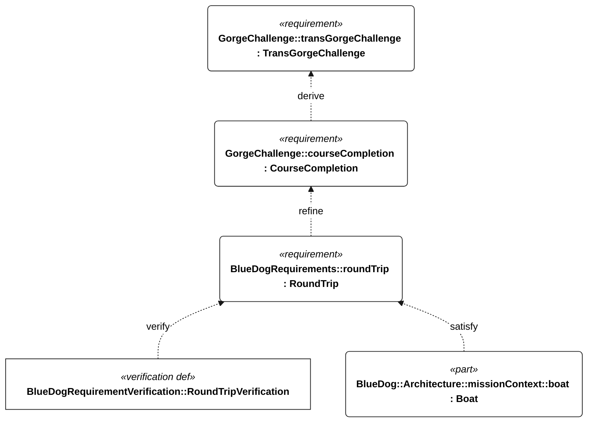
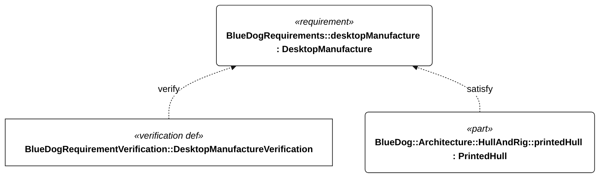
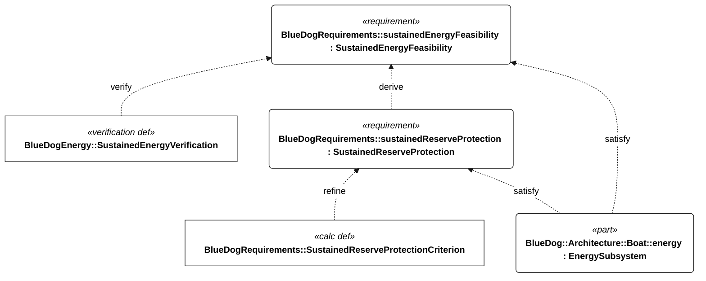
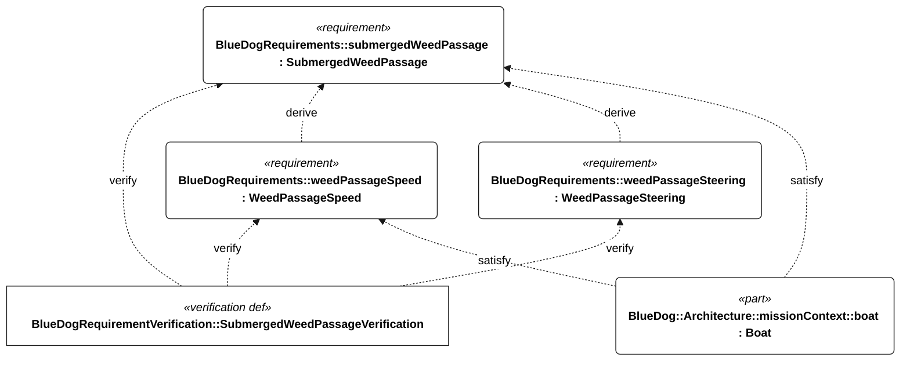

# Design process and current model

SV Blue Dog explores autonomous sailing and desktop manufacture, with the Trans-Gorge challenge as a proving ground for the longer-term Hawaii objective. The checked-in SysML is the design source of truth. Published views are generated from it; prose explains how to read and develop the design.

## Follow the design

| Step | Authoritative model | Generated view |
| --- | --- | --- |
| Define the challenge independently of the boat | [challenge.sysml](../models/challenge.sysml) | [Challenge brief](challenge-brief.md) |
| Connect vehicle obligations to the mission and owner constraints | [requirements.sysml](../models/requirements.sysml), [blue-dog.sysml](../models/blue-dog.sysml) | [Focused derivations](requirements-views.md), [register](requirements-register.md) |
| Define system context, traffic and logical responsibilities | [blue-dog.sysml](../models/blue-dog.sysml) | [Context](figures/context.md), [composition](figures/architecture.md), [detail](figures/architecture-detail.md) |
| Connect operational use cases and design allocations | [use-cases.sysml](../models/use-cases.sysml), [satisfaction.sysml](../models/satisfaction.sysml) | [Use cases](figures/use-cases.md), [traceability](traceability.md) |
| Assess performance and failure modes | Analysis models linked below | Native reports linked below |
| Define acceptance and collect evidence | Requirement predicates and verification cases | [Conditions, rationale, issues and verification specifications](requirements-context.md) |

Requirements state obligations concisely. Qualification conditions remain normative and separate; rationale explains decisions; issue metadata records unresolved questions. Follow a parent to its individual acceptance outcomes rather than treating a derivation arrow as a combined pass/fail rule.

The architecture describes logical responsibilities, not selected boards or a completed physical design. Satisfaction relationships record intended allocations. Mission actions are decomposed, but do not yet form an executable controller. The CAD in this repository is a manufacturing and wing-sail prototype, not the qualified challenge vessel.

## Read the relationships

`derive` connects a required acceptance outcome back to its original requirement. `refine` points from a more precise representation to the requirement it clarifies. `satisfy` records the intended design allocation; `verify` identifies what a verification case evaluates. None of these arrows is a passing test result.

The two mission drivers remain Trans-Gorge and Hawaii. Their engineering implications include selected profiles, design choices and evidence obligations; mission completion alone does not imply every such choice. Those plain dependencies are recorded in the [relationship register](relationship-register.md) and focused views. The native GeneralView renderer does not draw plain dependencies.

### Challenge to vehicle

The ordered gate definition refines course completion. The boat is allocated that obligation, and a separate case specifies its verification.

<!-- diagram:mission-semantics -->

<!-- /diagram -->

### Independent construction constraint

One-person handling, the 250 mm printer volume and serviceability are owner-imposed constraints alongside the missions. The printer requirement remains binding without pretending it follows from successful sailing.

<!-- diagram:manufacturing-semantics -->

<!-- /diagram -->

### Energy acceptance

The criterion calculation refines numerical reserve acceptance. The verification case runs the sustained-operation analysis; it requires accepted evidence before returning a pass. Read the [energy guide](sustained-operations.md) for the model boundaries.

<!-- diagram:energy-semantics -->

<!-- /diagram -->

### Weed tolerance

The Gorge vegetation requirement separates speed and steering acceptance while retaining a shared qualification campaign. The intended boat allocation and planned verification stay distinct.

<!-- diagram:weed-semantics -->

<!-- /diagram -->

## Use analysis to refine the design

| Question | Method and limitations | Generated evidence |
| --- | --- | --- |
| Can loads and harvesting sustain operation? | [Energy model guide](sustained-operations.md) | [Load budget](energy-budget.md), [native results](analysis/sustained-energy.json) |
| Which recovery propulsion medium is practical? | [Water/air propeller trade](recovery-propulsion-trade.md) | [Native candidate results](analysis/recovery-trade.json) |
| What polar and hull regime could deliver the required progress? | [Sailing-performance guide](sailing-performance.md) | [Polar demand and hull screening](sailing-performance-results.md) |
| How does cruise speed change reliability exposure? | [Cruise/reliability guide](cruise-reliability.md) | [Results](cruise-reliability-results.md), [native analysis](analysis/cruise-reliability.json) |
| Which failures need design action? | [DFMEA model](../models/dfmea.sysml) | [DFMEA](dfmea.md), [review results](analysis/dfmea.json) |

Example inputs support sensitivity studies, not hardware qualification. Numerical feasibility, accepted evidence and verification verdicts are separate. The current examples use unaccepted evidence; planned verification cases remain inconclusive. Physical trials must identify the configuration, applicable conditions, measurements and review disposition.

Unresolved acceptance decisions belong in model metadata, exposed in the context report. External applicability references are retained in the [source register](operating-constraints.md). Do not infer operating authorization from model consistency.

## Maintain one source of truth

Edit requirements, thresholds, relationships, architecture and analysis logic in SysML. Regenerate the reports and diagrams with the same change. Keep authored pages focused on purpose, method, evidence interpretation and navigation; link to generated statements and results instead of copying tables, counts or verdicts.

Review conversations, audit transcripts, temporary checklists and superseded snapshots belong in Git history or working notes outside tracked documentation. The [project article](restarting-sv-blue-dog.md) gives a short account of the design approach and links to the current model rather than acting as a second requirements register.

See [modeling and publishing](../models/README.md) for commands and checks.
