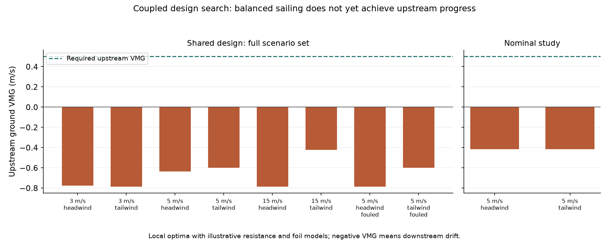
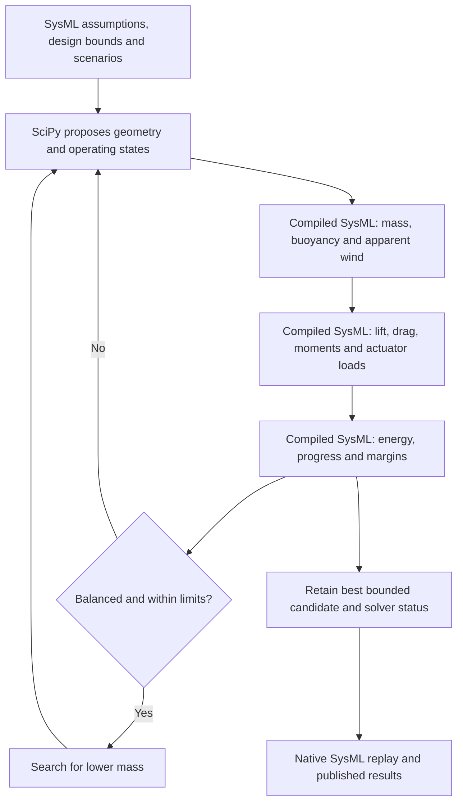
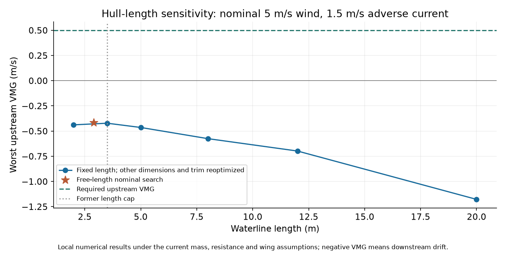

# Searching for a boat that can make progress

Current design direction: [two-metre mission sizing](mission-sizing.md), with route progress, modular handling and recovery screening.

The earlier [sail, keel and rudder study](appendage-sizing.md) could find a numerical fit when hull resistance was supplied as an input. I wanted to know whether that fit would survive when the boat had to carry its own ballast, wing, battery and solar panel. This search closes those loops: the same geometry must balance the sailing loads in several wind and fouling cases while carrying its electrical system.

The original bounded search was a useful setback. Three starting points found balanced sailing states, but none found a design meeting upstream progress. The nominal 5 m/s-wind study reached a worst upstream VMG of approximately **−0.41 m/s**; the broader scenario study reached approximately **−0.79 m/s**, against a target of **+0.50 m/s**. Negative VMG means drifting downstream despite sailing through the water. These are local search results within the declared bounds, not proof that no boat can complete the challenge.

The [native replay report](design-search-results.md) recomputes the checks from saved geometry and trim. The [search record](analysis/design-search.json) retains all starts, solver messages, inputs, outputs and source hashes; the [native audit](analysis/design-search-audit.json) independently evaluates the selected candidates. Neither result is a selected or qualified vessel design.

The current [FDM/glass structural sizing study](structure-sizing.md) adds mass, strength, stiffness and hydrostatic constraints to the [joint sizing study](#joint-sizing-without-premature-dimension-caps) removes those premature dimension caps. The original and length-only screens below remain comparisons, not the current sizing policy.

## What is solved

One shared design has thirteen variables: waterline length, beam, wing area and aspect ratio, keel and rudder areas and spans, ballast, wing longitudinal position, battery capacity, panel area and actuator rating. Each operating point has six variables: boat speed, heading, wing incidence, leeway, rudder angle and heel.

The broader study contains headwind and tailwind cases at 3, 5 and 15 m/s water-relative true wind, plus both directions at 5 m/s with increased profile/hull drag. Every point is assessed against an upstream adverse current. This tests both wind directions for the difficult leg; it is not a time-resolved voyage, a complete environmental envelope, or a Hawaii simulation. The separate nominal study diagnoses the 5 m/s clean-water cases without replacing the broader study.

SciPy first seeks balanced states and non-progress constraints using least squares. SLSQP then maximizes the worst progress while keeping force/moment balances and hardware constraints explicit. Only a candidate passing all numerical screens proceeds to mass minimization. A final fixed-geometry trim search improves each operating point. Variables are scaled to their bounds, and three deterministic starts reduce dependence on one initial guess. This does not establish a global optimum. [SciPy optimization methods](https://docs.scipy.org/doc/scipy/reference/optimize.html)

## Where the equations live

[design-physics.sysml](../models/design-physics.sysml) owns the engineering calculations. [design-search.sysml](../models/design-search.sysml) owns the assumptions, bounds, output contract and audit. OpenSysML compiles the calculation to C; a small Python adapter calls it during the SciPy search. The native interpreter then replays the saved designs, with tests comparing every reported output against the compiled execution.

SysML v2 explicitly anticipates simultaneous equations and external solvers in analysis cases. The current adapter is a practical integration, not a new modeling language or an upstream OpenSysML change. A later numerical-backend proposal could replace the explicit Python mapping of equality residuals, inequality margins and objective with model-driven discovery. [SysML v2 §7.23.1, printed page 138](https://www.omg.org/spec/SysML/2.0/Language/PDF#page=170)

## Assumptions that matter

| Model | Current treatment and limit |
| --- | --- |
| Wing | Finite-wing lift slope varies with aspect ratio and incidence; profile plus induced drag, with an explicit lift cap. Coefficients and minimum Reynolds number are assumptions pending low-Re wing data. No stall, separation or detailed downwind polar is modeled. |
| Hull | A rectangular displacement surrogate solves draft from mass and buoyancy. Viscous resistance uses the ITTC-1957 correlation with an assumed form factor; wave resistance is an explicitly heuristic mass/Froude term. No fitted hull resistance or planing model exists. |
| Stability | Waterplane inertia and component vertical mass/buoyancy moments give a small-angle righting surrogate. It supports a heel screen, not a large-angle righting curve or self-righting proof. |
| Keel and rudder | Finite-span lift slopes, profile/induced drag, signed yaw balance and a rudder inflow factor. The low-speed steering screen includes a yaw reserve and a feathered-wing side-load assumption. Fouling raises drag; it does not simulate milfoil wrapping or lift loss. |
| Packaging | Separate hull and detachable keel assemblies are each limited to the lifting allowance. Deck area limits solar area. Structural strength, joints, 250 mm printer segmentation and attachment loads remain outside this search. |
| Energy | Estimated actuation power depends on modeled torque and motion duty. An 18-hour dark/6-hour solar cycle checks balance, initial-night recovery reserve and peak battery withdrawal, including conversion losses. Constant electronics load, solar resource and repeated daily weather are assumptions. This is a sizing screen, not evidence of indefinite operation. |

The lift/drag formulation follows the standard coefficient approach, including aspect-ratio-dependent induced drag. Actual coefficients must be measured or computed for the wing and foils at their operating Reynolds numbers. [NASA induced drag](https://www1.grc.nasa.gov/beginners-guide-to-aeronautics/induced-drag-coefficient/), [NASA lift coefficients](https://www1.grc.nasa.gov/beginners-guide-to-aeronautics/lift-coefficient-2/)

The viscous correlation is only one contribution to resistance. The added wave term is a project assumption, not an ITTC resistance prediction or a validated VPP. The Froude ceiling bounds this surrogate's search space; it does not identify a displacement-to-planing transition. [ITTC resistance-test procedure](https://www.ittc.info/media/8169/75-03-03-01.pdf)

## What this changes

The earlier low-rig example still passes its prescribed-resistance screen. It does not establish feasibility once mass and resistance are coupled. In this search, even the nominal candidate's effective water VMG is insufficient to overcome the assumed current and retain the required progress margin.

The selected candidates sit on several declared limits, including wing height, heel reserve, low-speed steering and energy balance. The nominal search also reaches the ballast bound. These active constraints identify useful sensitivity studies; they do not by themselves establish which change will recover feasibility.

The next useful evidence is a resistance curve for candidate hulls and a credible low-Re wing polar. Then we can test sensitivity to hull/wing limits, current exposure and the planning speed allowance. The current's spatial and temporal variation needs a route study; changing a constant in this screen would not establish that a route is navigable. We should retain the failed cases as regression examples for any future OpenSysML nonlinear-optimization integration.

Run instructions are in the [modeling guide](../models/README.md#coupled-design-search).

## Does a longer hull solve it?

Removing the exploratory 3.5 m waterline-length cap did **not** recover mission feasibility. Five starts for each free-length study returned to the same best lengths: about 2.02 m for the broader scenario set and 2.89 m for nominal 5 m/s wind. Those lengths are already below the old cap. No feasible candidate was found, so there is no supported minimum mission-achieving length to report.

The study changes only the length search domain; it reoptimizes the other dimensions and trim within their existing bounds. It retains the handling, rig, appendage, energy and progress constraints. Instead of an arbitrary larger cap, it uses a ceiling implied by the current shell-mass model: body mass is at least `2 × skin areal mass × length × beam`. The 15 kg body limit, 1.2 kg/m² skin assumption and 0.20 m minimum beam give a generous 31.25 m ceiling. Other component masses tighten that limit. This is a search-domain bound, not a recommendation for a 31 m vessel.

To check for missed longer-hull solutions, three starts also reoptimized each of six fixed lengths under nominal wind. The [native replay table](hull-length-results.md) reports the selected results. Worst upstream VMG deteriorates from roughly −0.42 m/s at 3.5 m to −0.46 at 5 m, −0.58 at 8 m, −0.70 at 12 m and −1.18 at 20 m. All remain below the +0.50 m/s target. These are local search results, not a mathematical infeasibility proof.

Length reduces the model's wave-resistance term at a given speed, but adds wetted surface and shell mass. At long lengths, the retained handling limit also restricts the remaining hardware budget; the 20 m candidate reaches the body-mass limit with a much smaller wing. The simplified shell and resistance assumptions are being extrapolated here; they do not include a structural stiffness or hull-form design analysis.

The useful conclusion is that **length alone is not the limiting design allowance in this model**. A next design-space experiment should investigate rig area and height together with stability, alongside validation of hull resistance and the wing polar. Simply making the hull longer does not close the modeled progress gap.

The [study definition](../models/hull-length-study.sysml), [reproducible search record](analysis/hull-length.json) and [native audit](analysis/hull-length-audit.json) preserve this comparison separately from the original search.

## Joint sizing without premature dimension caps

The initial open-sizing search varied fifteen represented sizing quantities together: the original thirteen dimensions/capacities, plus freeboard and rudder longitudinal position. Wing height follows wing area and aspect ratio; draft and total mass follow buoyancy and the mass budget. There is no separate 2 m wing-height cap and no minimum-length objective.

The objective has two stages: first find a balanced design meeting the selected progress screen, then minimize total mass while retaining the screen constraints. Until progress passes, the search maximizes the worst progress margin. It never treats an unbalanced force/moment solution as a useful sailing result.

Numerical brackets are deliberately wider than the original bounds. Any expandable sizing bracket approached within 0.5% relative to its endpoint/value (absolute floor 1e-8) is enlarged for the next round, with a previous candidate reused as a starting point. The run stops after its declared round budget; remaining boundary hits are reported, not accepted as design limits. The complete brackets and all starts are in the [search record](analysis/open-sizing.json). Positive lower bounds avoid singular geometry. Sail/rudder placement remains within the modeled hull; ballast, battery, panel and actuator upper ceilings follow the retained 15 kg assembly limit and mass assumptions.

[Generated results and dimensions](open-sizing-results.md) report the current outcome. The selected designs are independently replayed through the native SysML interpreter, with every output compared against compiled execution. Freeboard contributes side-shell mass as well as wing/panel elevation. The structural extension now includes shell vertical mass moments and distinct foil mass moments; fixed equipment is still represented at waterline.

**A numerical fit is not yet a mission-feasible vessel.** These comparisons retain the original stationary scenarios and their 1.5 m/s opposing current. Q-101 requires mean progress over a declared sailing leg; N-011 and N-013 explicitly do not require upstream progress everywhere. We must use a route/time profile before drawing a mission-completion conclusion. Keeping the stress screen makes the effect of broader sizing freedom visible without quietly improving the weather assumptions.

Hull-form coefficients, material properties and lift/drag coefficients remain documented model assumptions. They are not selectable favorable physics. At that stage, structural strength/stiffness, appendage attachment loads, practical assembly dimensions, minimum safe freeboard, reserve buoyancy and detailed hull-form optimization were missing. The current structural extension addresses the first-order strength/stiffness, freeboard and buoyancy screens; physical validation and detailed hull/attachment design remain open. In particular, a long keel or near-zero freeboard is evidence that those constraints need implementation, not a design recommendation. Fifteen live sizing variables do not mean every possible vessel architecture is represented.

The current [structural extension](structure-sizing.md) also sizes four independent glass layups and hull rib spacing, for twenty represented sizing quantities. It adds bending, panel, freeboard, reserve-buoyancy and launch-clearance checks, then re-solves using whole-ply layups. The [study definition](../models/open-sizing.sysml) owns the sizing calculation and brackets. The [driver](../scripts/study_open_sizing.py) manages numerical optimization, expansion and reproducible publication. This is the current sizing workflow; the original and length-only studies remain bounded comparisons.
