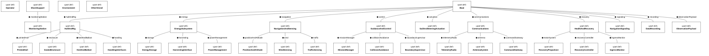

# Detailed composition

<!-- Generated from SysML by scripts/render_requirements.py; edit the model, not this file. -->

```mermaid
---
config:
  fontFamily: "Helvetica, Arial, sans-serif"
  theme: base
  themeCSS: ".edgeLabel rect { opacity: 1 !important; } .cluster-label .nodeLabel { text-align: center; }"
  themeVariables:
    fontFamily: "Helvetica, Arial, sans-serif"
    fontSize: "14px"
    primaryColor: "#FFFFFF"
    secondaryColor: "#FFFFFF"
    tertiaryColor: "#FFFFFF"
    background: "#FFFFFF"
    primaryBorderColor: "#181818"
    primaryTextColor: "#000000"
    lineColor: "#181818"
    textColor: "#000000"
    noteBkgColor: "#FEFFDD"
    noteBorderColor: "#181818"
    noteTextColor: "#000000"
    clusterBkg: "#FFFFFF"
    clusterBorder: "#181818"
    edgeLabelBackground: "#FFFFFF"
---
%% BlueDogArchitectureViews::detail — definition rendering (view def GeneralView, filter @PartDefinition)
flowchart TB
  n0["`*«part def»*
**Operator**`"]
  n1["`*«part def»*
**MonitoringStation**`"]
  n2["`*«part def»*
**ShoreSupport**`"]
  n3["`*«part def»*
**Environment**`"]
  n4["`*«part def»*
**OtherVessel**`"]
  n5["`*«part def»*
**PrintedHull**`"]
  n6["`*«part def»*
**SealedEnclosure**`"]
  n7["`*«part def»*
**KeelAndBallast**`"]
  n8["`*«part def»*
**HandlingInterfaces**`"]
  n9["`*«part def»*
**HullAndRig**`"]
  n10["`*«part def»*
**EnergyStorage**`"]
  n11["`*«part def»*
**HarvestingInterface**`"]
  n12["`*«part def»*
**PowerManagement**`"]
  n13["`*«part def»*
**EnergySubsystem**`"]
  n14["`*«part def»*
**PositionAndAttitude**`"]
  n15["`*«part def»*
**WindSensing**`"]
  n16["`*«part def»*
**TrafficSensing**`"]
  n17["`*«part def»*
**NavigationAndSensing**`"]
  n18["`*«part def»*
**MissionManager**`"]
  n19["`*«part def»*
**CollisionAvoidance**`"]
  n20["`*«part def»*
**BoundarySupervisor**`"]
  n21["`*«part def»*
**GuidanceAndControl**`"]
  n22["`*«part def»*
**SailAndSteeringActuation**`"]
  n23["`*«part def»*
**TelemetryRadio**`"]
  n24["`*«part def»*
**AntennaSystem**`"]
  n25["`*«part def»*
**CommandGateway**`"]
  n26["`*«part def»*
**Communications**`"]
  n27["`*«part def»*
**RecoveryPropulsion**`"]
  n28["`*«part def»*
**RecoveryController**`"]
  n29["`*«part def»*
**IngressMonitor**`"]
  n30["`*«part def»*
**HealthAndRecovery**`"]
  n31["`*«part def»*
**NavigationSignaling**`"]
  n32["`*«part def»*
**DataRecording**`"]
  n33["`*«part def»*
**ObservationPayload**`"]
  n34["`*«part def»*
**Boat**`"]
  n2 ---|"◆ monitoringStation"| n1
  n9 ---|"◆ printedHull"| n5
  n9 ---|"◆ enclosure"| n6
  n9 ---|"◆ keelAndBallast"| n7
  n9 ---|"◆ handling"| n8
  n13 ---|"◆ storage"| n10
  n13 ---|"◆ harvesting"| n11
  n13 ---|"◆ powerManagement"| n12
  n17 ---|"◆ positionAndAttitude"| n14
  n17 ---|"◆ wind"| n15
  n17 ---|"◆ traffic"| n16
  n21 ---|"◆ missionManager"| n18
  n21 ---|"◆ collisionAvoidance"| n19
  n21 ---|"◆ boundarySupervisor"| n20
  n26 ---|"◆ telemetryRadio"| n23
  n26 ---|"◆ antenna"| n24
  n26 ---|"◆ commandGateway"| n25
  n30 ---|"◆ motorSystem"| n27
  n30 ---|"◆ recoveryController"| n28
  n30 ---|"◆ ingressMonitor"| n29
  n34 ---|"◆ hullAndRig"| n9
  n34 ---|"◆ energy"| n13
  n34 ---|"◆ navigation"| n17
  n34 ---|"◆ control"| n21
  n34 ---|"◆ actuation"| n22
  n34 ---|"◆ communications"| n26
  n34 ---|"◆ recovery"| n30
  n34 ---|"◆ recording"| n32
  n34 ---|"◆ signaling"| n31
  n34 ---|"◆ observationPayload"| n33
```
