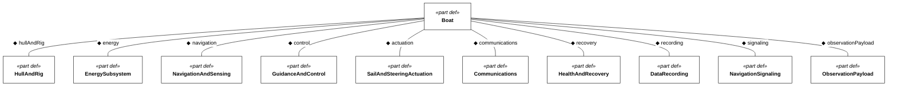

# Boat definition and composition

```mermaid
---
config:
  fontFamily: "Helvetica, Arial, sans-serif"
  theme: base
  themeCSS: ".edgeLabel rect { opacity: 1 !important; } .cluster-label .nodeLabel { text-align: center; }"
  themeVariables:
    fontFamily: "Helvetica, Arial, sans-serif"
    fontSize: "14px"
    primaryColor: "#FFFFFF"
    secondaryColor: "#FFFFFF"
    tertiaryColor: "#FFFFFF"
    background: "#FFFFFF"
    primaryBorderColor: "#181818"
    primaryTextColor: "#000000"
    lineColor: "#181818"
    textColor: "#000000"
    noteBkgColor: "#FEFFDD"
    noteBorderColor: "#181818"
    noteTextColor: "#000000"
    clusterBkg: "#FFFFFF"
    clusterBorder: "#181818"
    edgeLabelBackground: "#FFFFFF"
---
%% BlueDogArchitectureViews::architecture — definition rendering (view def GeneralView, filter @PartDefinition)
flowchart TB
  n0["`*«part def»*
**Boat**`"]
  n1["`*«part def»*
**NavigationSignaling**`"]
  n2["`*«part def»*
**HullAndRig**`"]
  n3["`*«part def»*
**EnergySubsystem**`"]
  n4["`*«part def»*
**NavigationAndSensing**`"]
  n5["`*«part def»*
**GuidanceAndControl**`"]
  n6["`*«part def»*
**SailAndSteeringActuation**`"]
  n7["`*«part def»*
**Communications**`"]
  n8["`*«part def»*
**HealthAndRecovery**`"]
  n9["`*«part def»*
**DataRecording**`"]
  n10["`*«part def»*
**ObservationPayload**`"]
  n0 ---|"◆ hullAndRig"| n2
  n0 ---|"◆ energy"| n3
  n0 ---|"◆ navigation"| n4
  n0 ---|"◆ control"| n5
  n0 ---|"◆ actuation"| n6
  n0 ---|"◆ communications"| n7
  n0 ---|"◆ recovery"| n8
  n0 ---|"◆ recording"| n9
  n0 ---|"◆ signaling"| n1
  n0 ---|"◆ observationPayload"| n10
```
