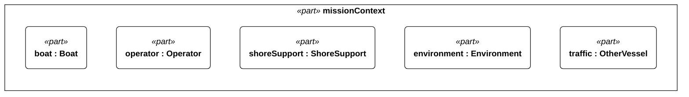

# Mission context

```mermaid
---
config:
  fontFamily: "Helvetica, Arial, sans-serif"
  theme: base
  themeCSS: ".edgeLabel rect { opacity: 1 !important; } .cluster-label .nodeLabel { text-align: center; }"
  themeVariables:
    fontFamily: "Helvetica, Arial, sans-serif"
    fontSize: "14px"
    primaryColor: "#FFFFFF"
    secondaryColor: "#FFFFFF"
    tertiaryColor: "#FFFFFF"
    background: "#FFFFFF"
    primaryBorderColor: "#181818"
    primaryTextColor: "#000000"
    lineColor: "#181818"
    textColor: "#000000"
    noteBkgColor: "#FEFFDD"
    noteBorderColor: "#181818"
    noteTextColor: "#000000"
    clusterBkg: "#FFFFFF"
    clusterBorder: "#181818"
    edgeLabelBackground: "#FFFFFF"
---
%% BlueDogArchitectureViews::context — interconnection rendering (render Views::asInterconnectionDiagram)
flowchart TB
  subgraph n0 ["`*«part»* **missionContext**`"]
    direction TB
    n1("`*«part»*
**boat : Boat**`")
    n2("`*«part»*
**operator : Operator**`")
    n3("`*«part»*
**shoreSupport : ShoreSupport**`")
    n4("`*«part»*
**environment : Environment**`")
    n5("`*«part»*
**traffic : OtherVessel**`")
  end
```
