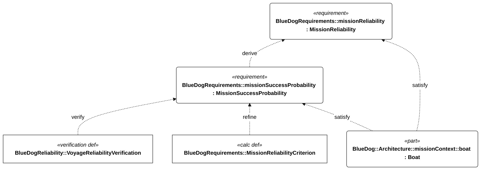

# Reliability acceptance and numerical refinement

<!-- Generated from SysML by scripts/render_requirements.py; edit the model, not this file. -->

```mermaid
---
config:
  fontFamily: "Helvetica, Arial, sans-serif"
  theme: base
  themeCSS: ".edgeLabel rect { opacity: 1 !important; } .cluster-label .nodeLabel { text-align: center; }"
  themeVariables:
    fontFamily: "Helvetica, Arial, sans-serif"
    fontSize: "14px"
    primaryColor: "#FFFFFF"
    secondaryColor: "#FFFFFF"
    tertiaryColor: "#FFFFFF"
    background: "#FFFFFF"
    primaryBorderColor: "#181818"
    primaryTextColor: "#000000"
    lineColor: "#181818"
    textColor: "#000000"
    noteBkgColor: "#FEFFDD"
    noteBorderColor: "#181818"
    noteTextColor: "#000000"
    clusterBkg: "#FFFFFF"
    clusterBorder: "#181818"
    edgeLabelBackground: "#FFFFFF"
---
%% BlueDogSemanticViews::ReliabilitySemantics — requirement rendering (view def GeneralView, filter @RequirementUsage)
%% not represented: 10 node(s) without a position, left undrawn, and 18 edge(s) at them
%% layout: n0 x=0 y=0
%% layout: n1 x=360 y=0
%% layout: n2 x=360 y=200
%% layout: n12 x=0 y=200
%% layout: n14 x=0 y=400
flowchart BT
  n0("`*«requirement»*
**BlueDogRequirements::missionReliability : MissionReliability**`")
  n1("`*«requirement»*
**BlueDogRequirements::missionSuccessProbability : MissionSuccessProbability**`")
  n2["`*«verification def»*
**BlueDogReliability::VoyageReliabilityVerification**`"]
  n12["`*«calc def»*
**BlueDogRequirements::MissionReliabilityCriterion**`"]
  n14("`*«part»*
**BlueDog::Architecture::missionContext::boat : Boat**`")
  n2 -.->|"verify"| n1
  n1 -.->|"derive"| n0
  n12 -.->|"refine"| n1
  n14 -.->|"satisfy"| n0
  n14 -.->|"satisfy"| n1
```
