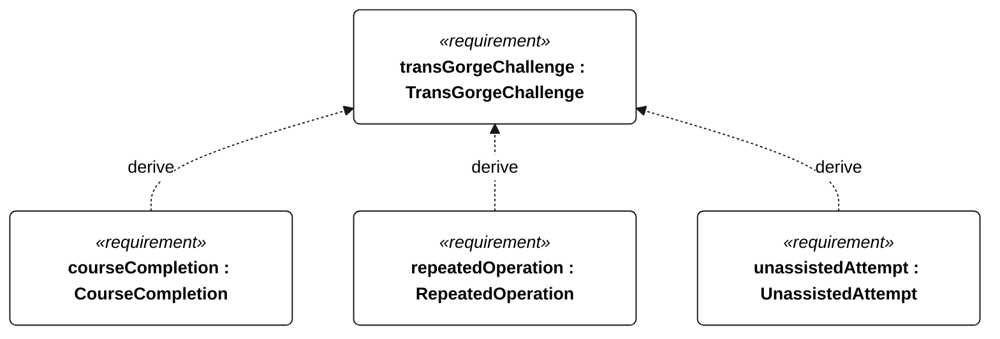
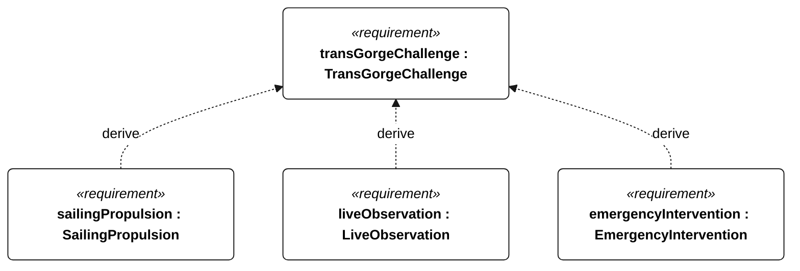

# C-000 trans gorge challenge

[All requirement views](<../requirements-views.md>)

[Qualification conditions, rationale, open issues and verification](<../requirements-context.md>)

**C-000 TransGorgeChallenge** — The vessel shall complete the Trans-Gorge challenge under C-001 through C-006.

**C-001 CourseCompletion** — The vessel shall complete a journey from The Dalles to Bonneville and back to The Dalles.

**C-002 RepeatedOperation** — After its first circuit, the vessel should repeat The Dalles–Bonneville–The Dalles autonomously for as long as practical.

**C-003 UnassistedAttempt** — A qualifying attempt shall complete the round trip without operator intervention.

**C-004 SailingPropulsion** — A qualifying attempt shall use sailing propulsion without auxiliary motor propulsion.

**C-005 LiveObservation** — The vessel shall provide live monitoring with autonomous operation and retained telemetry across communication outages.

**C-006 EmergencyIntervention** — The vessel shall permit remote emergency abort or manual control when a command link is available.

## C-000 derivation 1

## C-000 derivation 2

[Continue: C-001 course completion](<requirements-c-001.md>)

[Continue: C-002 repeated operation](<requirements-c-002.md>)

[Continue: C-003 unassisted attempt](<requirements-c-003.md>)

[Continue: C-004 sailing propulsion](<requirements-c-004.md>)

[Continue: C-005 live observation](<requirements-c-005.md>)

[Continue: C-006 emergency intervention](<requirements-c-006.md>)
