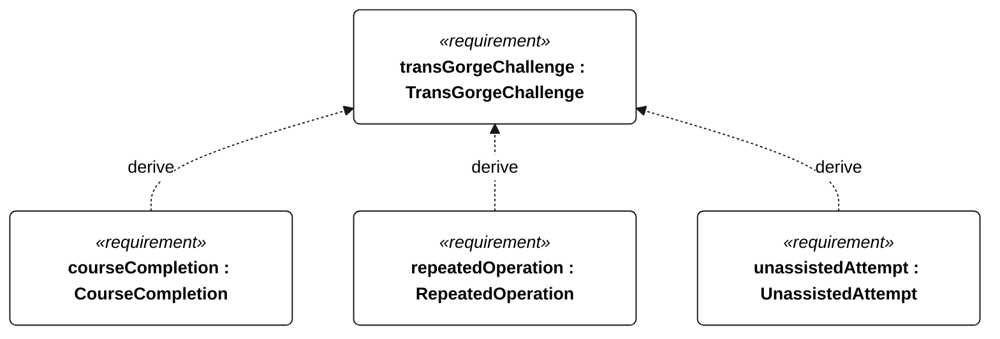
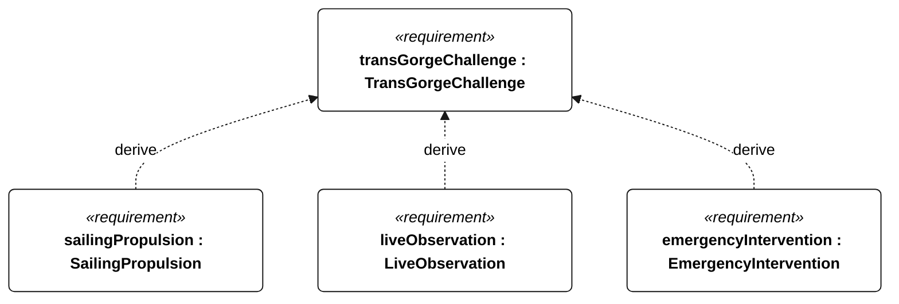

# C-000 trans gorge challenge

[All requirement views](<../requirements-views.md>)

**TransGorgeChallenge** — Complete the autonomous Trans-Gorge sailing challenge: The Dalles-Bonneville-The Dalles as the threshold, then repeat for as long as practical, under the course, autonomy, propulsion, observation, and emergency intervention rules below.

**CourseCompletion** — Threshold: Complete a journey from The Dalles to Bonneville and back to The Dalles. Exact start/finish and turnaround gates, permitted corridor, and crossing evidence remain to be agreed.

**RepeatedOperation** — Objective beyond the first completed round trip: repeat The Dalles-Bonneville-The Dalles autonomously for as long as practical. No fixed objective endurance duration has been selected.

**UnassistedAttempt** — A qualifying attempt shall complete the round trip without operator intervention. Passive live monitoring is permitted. Any use of remote emergency abort or manual control disqualifies the attempt as unassisted. Restart criteria remain to be agreed.

**SailingPropulsion** — A qualifying challenge attempt shall use sailing propulsion without auxiliary motor propulsion. Auxiliary motor use is allowed during development tests, which do not count as challenge attempts. Motor use during an attempt prevents it from qualifying. An auxiliary motor may remain installed for vessel recovery. Recovery propulsion is permitted outside the qualifying attempt; use during an attempt ends that attempt without qualification. The restriction concerns propulsion, not electrical power for onboard systems.

**LiveObservation** — Live monitoring shall be available to the operator. Monitoring-link loss shall not interrupt autonomous mission execution. Telemetry shall be retained onboard and transmitted when contact returns. Coverage, update rate, retained data, and outage retention duration are open.

**EmergencyIntervention** — Provide remote emergency abort or manual control when a command link is available. Use disqualifies the attempt as unassisted. Emergency abort behavior and the subsequent recovery procedure are open.

## C-000 derivation 1

## C-000 derivation 2

[Continue: C-001 course completion](<requirements-c-001.md>)

[Continue: C-002 repeated operation](<requirements-c-002.md>)

[Continue: C-003 unassisted attempt](<requirements-c-003.md>)

[Continue: C-004 sailing propulsion](<requirements-c-004.md>)

[Continue: C-005 live observation](<requirements-c-005.md>)

[Continue: C-006 emergency intervention](<requirements-c-006.md>)
