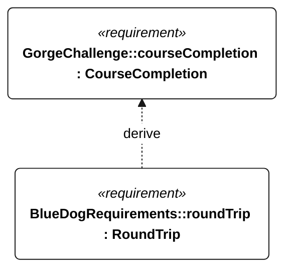

# C-001 course completion

[All requirement views](<../requirements-views.md>)

[Qualification conditions, rationale, open issues and verification](<../requirements-context.md>)

**C-001 CourseCompletion** — The vessel shall complete a journey from The Dalles to Bonneville and back to The Dalles.

**M-001 RoundTrip** — The vessel shall cross the configured The Dalles departure, Bonneville turnaround and The Dalles return gates in order during one qualifying attempt.

## C-001 derivation 1

[Continue: M-001 round trip](<requirements-m-001.md>)
