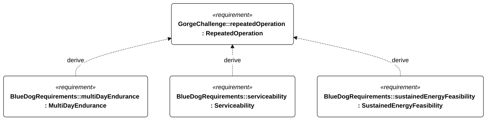

# C-002 repeated operation

[All requirement views](<../requirements-views.md>)

**RepeatedOperation** — Objective beyond the first completed round trip: repeat The Dalles-Bonneville-The Dalles autonomously for as long as practical. No fixed objective endurance duration has been selected.

**MultiDayEndurance** — The vessel shall operate for 72 continuous hours without servicing or external charging while meeting the Gorge operational functions under N-010 and the applicable shared N-001 conditions. A qualification run shall include three consecutive 24-hour cycles, each with at most 6 hours of harvesting and at least 18 hours with harvesting disabled. Harvest input shall be limited to the installed harvester output measured under a frozen, recorded resource profile; a test supply may replay that profile but shall not exceed its measured power or accumulated energy. The conservative usable-energy estimate shall remain above the R-002 recovery reserve throughout. Acceptance requires the initial battery state, harvester configuration, replay profile, actual harvested energy and loads in the test record; absent profile evidence invalidates the test. Passing does not establish indefinite energy balance.

**Serviceability** — Aggregate requirement for Serviceability. Acceptance requires all applicable derived leaf results (P-107, P-108, P-109, P-110); this parent has no independent executable pass/fail predicate. Shared verification context: Exercise individual replacement of the battery, every electronics module, every actuator and every serviceable enclosure seal by one operator using hand tools.

**SustainedEnergyFeasibility** — The installed energy architecture shall support the selected bounded repeating mission profile without external charging, while meeting the derived reserve, cycle-balance and peak-supply criteria. The 72-hour campaign is an initial energy demonstration, not proof of indefinite weather availability, functional performance or ocean readiness.

## C-002 derivation 1

[Continue: M-002 multi day endurance](<requirements-m-002.md>)

[Continue: P-003 serviceability](<requirements-p-003.md>)

[Continue: E-200 sustained energy feasibility](<requirements-e-200.md>)
