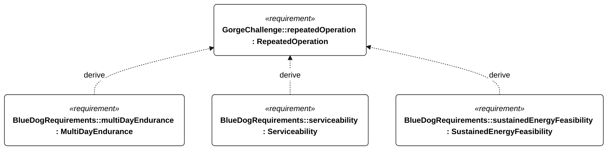

# C-002 repeated operation

[All requirement views](<../requirements-views.md>)

[Qualification conditions, rationale, open issues and verification](<../requirements-context.md>)

**C-002 RepeatedOperation** — After its first circuit, the vessel should repeat The Dalles–Bonneville–The Dalles autonomously for as long as practical.

**M-002 MultiDayEndurance** — The vessel shall operate for 72 continuous hours without servicing or external charging under the specified Gorge energy campaign.

**P-003 Serviceability** — The vessel shall support replacement of serviceable equipment without structural damage.

**E-200 SustainedEnergyFeasibility** — The installed energy architecture shall support the selected bounded repeating profile without external charging, meeting the derived reserve, cycle-balance and peak-supply criteria.

## C-002 derivation 1

[Continue: M-002 multi day endurance](<requirements-m-002.md>)

[Continue: P-003 serviceability](<requirements-p-003.md>)

[Continue: E-200 sustained energy feasibility](<requirements-e-200.md>)
