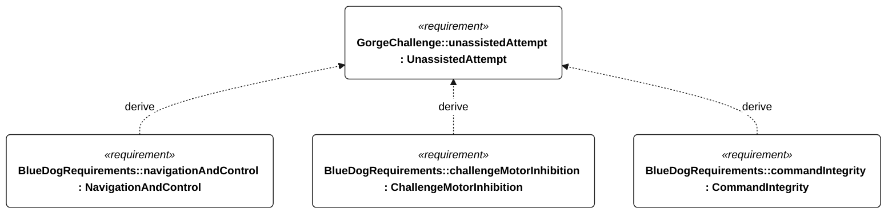

# C-003 unassisted attempt

[All requirement views](<../requirements-views.md>)

[Qualification conditions, rationale, open issues and verification](<../requirements-context.md>)

**C-003 UnassistedAttempt** — A qualifying attempt shall complete the round trip without operator intervention.

**E-002 NavigationAndControl** — The vessel shall provide autonomous navigation and sail/steering control within the selected operational profile.

**R-004 ChallengeMotorInhibition** — The vessel shall prevent motor propulsion from qualifying as unassisted sailing.

**C-102 CommandIntegrity** — The vessel shall accept external commands only under the specified authentication, freshness and qualification rules.

## C-003 derivation 1

[Continue: E-002 navigation and control](<requirements-e-002.md>)

[Continue: R-004 challenge motor inhibition](<requirements-r-004.md>)

[Continue: C-102 command integrity](<requirements-c-102.md>)
