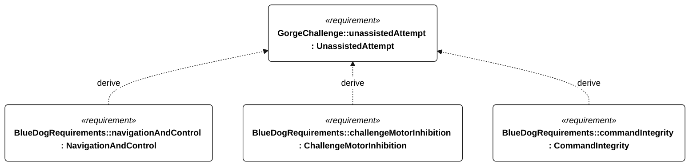

# C-003 unassisted attempt

[All requirement views](<../requirements-views.md>)

**UnassistedAttempt** — A qualifying attempt shall complete the round trip without operator intervention. Passive live monitoring is permitted. Any use of remote emergency abort or manual control disqualifies the attempt as unassisted. Restart criteria remain to be agreed.

**NavigationAndControl** — Aggregate requirement for NavigationAndControl. Acceptance requires all applicable derived leaf results (E-105, E-106, E-107, E-108, E-109); this parent has no independent executable pass/fail predicate. Shared verification context: Qualification uses the selected mission profile. Accuracy trials contain 1800 scheduled one-second epochs in 30 minutes; invalid or missing epochs fail. Position and heading criteria use the same set of at least 1710 qualifying epochs, preventing separate selection of different good samples. Fault-injection runs are separate.

**ChallengeMotorInhibition** — Aggregate requirement for ChallengeMotorInhibition. Acceptance requires all applicable derived leaf results (R-101, R-102, E-138, E-132); this parent has no independent executable pass/fail predicate. Shared verification context: Exercise qualifying, nonqualifying and unknown qualification states, restart, link loss, power loss during transitions and conflicting/stale commands. Shared qualification persistence applies before enabling intervention.

**CommandIntegrity** — Aggregate requirement for CommandIntegrity. Acceptance requires all applicable derived leaf results (C-205, C-206, C-207, C-208, C-209, C-210, C-211, E-132, E-138); this parent has no independent executable pass/fail predicate. Shared verification context: Exercise complete command receipt, authentication failure, replayed sequence numbers, age greater than 30 seconds, and external control during a qualifying attempt.

## C-003 derivation 1

[Continue: E-002 navigation and control](<requirements-e-002.md>)

[Continue: R-004 challenge motor inhibition](<requirements-r-004.md>)

[Continue: C-102 command integrity](<requirements-c-102.md>)
