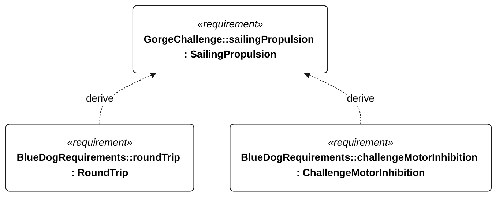

# C-004 sailing propulsion

[All requirement views](<../requirements-views.md>)

**SailingPropulsion** — A qualifying challenge attempt shall use sailing propulsion without auxiliary motor propulsion. Auxiliary motor use is allowed during development tests, which do not count as challenge attempts. Motor use during an attempt prevents it from qualifying. An auxiliary motor may remain installed for vessel recovery. Recovery propulsion is permitted outside the qualifying attempt; use during an attempt ends that attempt without qualification. The restriction concerns propulsion, not electrical power for onboard systems.

**RoundTrip** — The vessel shall cross the configured The Dalles departure gate, Bonneville turnaround gate and The Dalles return gate in that order during one attempt, satisfying C-003 through C-006. Acceptance shall use the timestamped trajectory and intervention/propulsion event log; a missing gate crossing or disqualifying event shall prevent a completion verdict.

**ChallengeMotorInhibition** — Aggregate requirement for ChallengeMotorInhibition. Acceptance requires all applicable derived leaf results (R-101, R-102, E-138, E-132); this parent has no independent executable pass/fail predicate. Shared verification context: Exercise qualifying, nonqualifying and unknown qualification states, restart, link loss, power loss during transitions and conflicting/stale commands. Shared qualification persistence applies before enabling intervention.

## C-004 derivation 1

[Continue: M-001 round trip](<requirements-m-001.md>)

[Continue: R-004 challenge motor inhibition](<requirements-r-004.md>)
