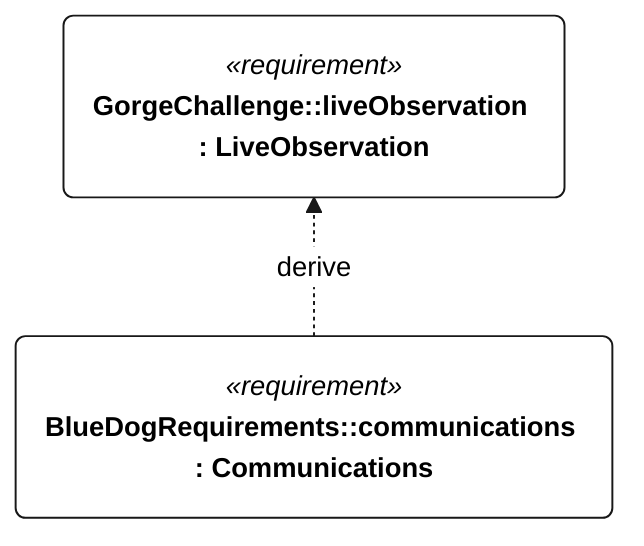

# C-005 live observation

[All requirement views](<../requirements-views.md>)

[Qualification conditions, rationale, open issues and verification](<../requirements-context.md>)

**C-005 LiveObservation** — The vessel shall provide live monitoring with autonomous operation and retained telemetry across communication outages.

**E-005 Communications** — The vessel shall support live telemetry through link outages and reconnection.

## C-005 derivation 1

[Continue: E-005 communications](<requirements-e-005.md>)
