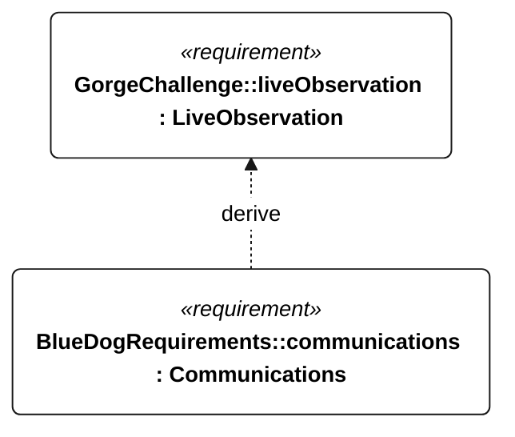

# C-005 live observation

[All requirement views](<../requirements-views.md>)

**LiveObservation** — Live monitoring shall be available to the operator. Monitoring-link loss shall not interrupt autonomous mission execution. Telemetry shall be retained onboard and transmitted when contact returns. Coverage, update rate, retained data, and outage retention duration are open.

**Communications** — Aggregate requirement for Communications. Acceptance requires all applicable derived leaf results (E-120, E-121, E-122, E-123, E-124, E-131, E-137); this parent has no independent executable pass/fail predicate. Shared verification context: Link availability is a delivery-test precondition, not a coverage guarantee. Normal cadence is 60 seconds; low-energy alone permits 300 seconds; emergency/powered recovery takes precedence at 60 seconds. Outage tests last 24 hours.

## C-005 derivation 1

[Continue: E-005 communications](<requirements-e-005.md>)
