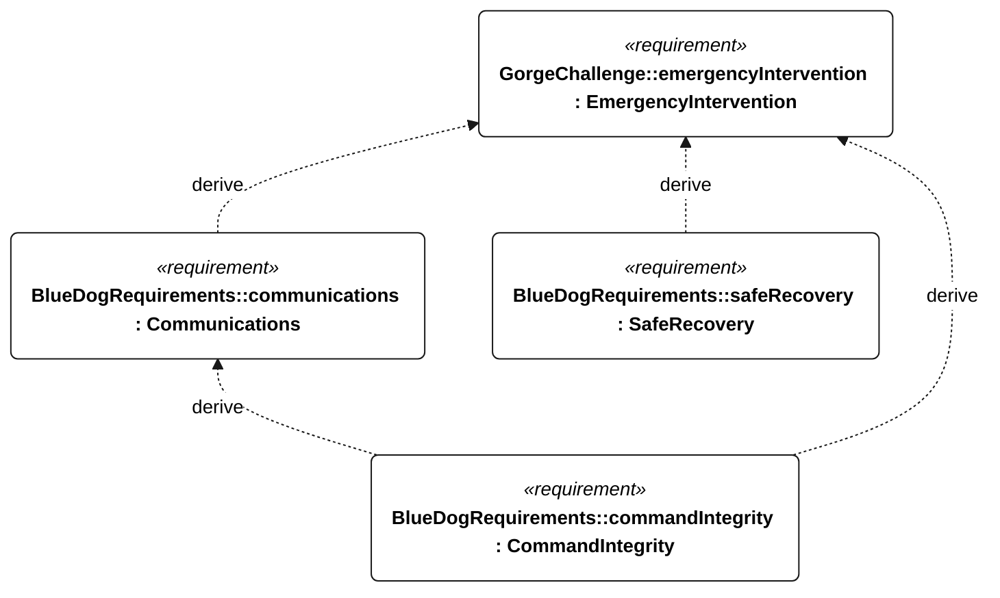

# C-006 emergency intervention

[All requirement views](<../requirements-views.md>)

**EmergencyIntervention** — Provide remote emergency abort or manual control when a command link is available. Use disqualifies the attempt as unassisted. Emergency abort behavior and the subsequent recovery procedure are open.

**Communications** — Aggregate requirement for Communications. Acceptance requires all applicable derived leaf results (E-120, E-121, E-122, E-123, E-124, E-131, E-137); this parent has no independent executable pass/fail predicate. Shared verification context: Link availability is a delivery-test precondition, not a coverage guarantee. Normal cadence is 60 seconds; low-energy alone permits 300 seconds; emergency/powered recovery takes precedence at 60 seconds. Outage tests last 24 hours.

**SafeRecovery** — Aggregate requirement for SafeRecovery. Acceptance requires all applicable derived leaf results (S-110, S-111, S-112, S-113, S-114, S-115, E-138, R-101, E-130); this parent has no independent executable pass/fail predicate. Shared verification context: Emergency intervention ends attempt qualification. Exercise active emergency, powered recovery, local isolation and remote-control loss, including coexisting low-energy flags.

**CommandIntegrity** — Aggregate requirement for CommandIntegrity. Acceptance requires all applicable derived leaf results (C-205, C-206, C-207, C-208, C-209, C-210, C-211, E-132, E-138); this parent has no independent executable pass/fail predicate. Shared verification context: Exercise complete command receipt, authentication failure, replayed sequence numbers, age greater than 30 seconds, and external control during a qualifying attempt.

## C-006 derivation 1

[Continue: E-005 communications](<requirements-e-005.md>)

[Continue: S-003 safe recovery](<requirements-s-003.md>)

[Continue: C-102 command integrity](<requirements-c-102.md>)
