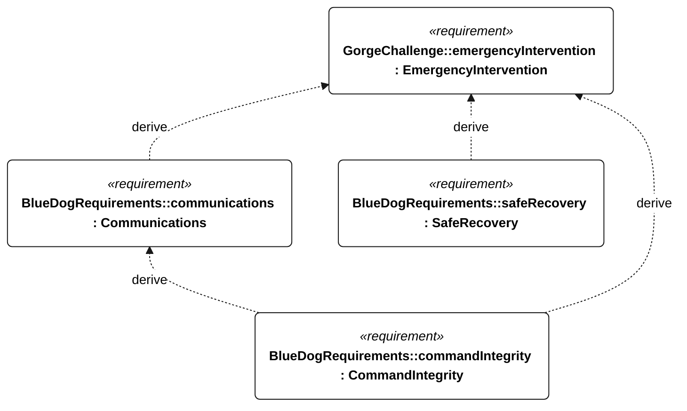

# C-006 emergency intervention

[All requirement views](<../requirements-views.md>)

[Qualification conditions, rationale, open issues and verification](<../requirements-context.md>)

**C-006 EmergencyIntervention** — The vessel shall permit remote emergency abort or manual control when a command link is available.

**E-005 Communications** — The vessel shall support live telemetry through link outages and reconnection.

**S-003 SafeRecovery** — The vessel shall support controlled emergency intervention and powered recovery.

**C-102 CommandIntegrity** — The vessel shall accept external commands only under the specified authentication, freshness and qualification rules.

## C-006 derivation 1

[Continue: E-005 communications](<requirements-e-005.md>)

[Continue: S-003 safe recovery](<requirements-s-003.md>)

[Continue: C-102 command integrity](<requirements-c-102.md>)
