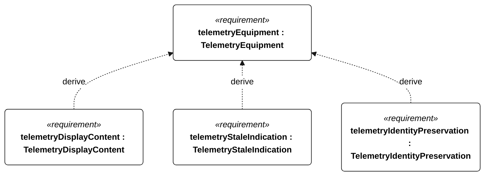
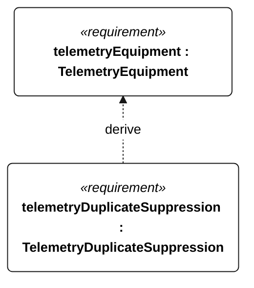

# C-101 TelemetryEquipment relationships

<!-- Generated from SysML by scripts/render_requirements.py; edit the model, not this file. -->

[All requirement views](<../requirements-views.md>)

[Conditions, rationale and verification](<../requirements-context.md>)

**C-101 TelemetryEquipment** — The shore endpoint shall present current vessel telemetry with explicit data age and identity.

**C-201 TelemetryDisplayContent** — The shore endpoint shall display UTC sample time, position, mode, conservative usable energy, reserve, faults and age from each current telemetry record.

**C-202 TelemetryStaleIndication** — The shore endpoint shall indicate stale data when record age exceeds its C-101 mode threshold until receipt of a record within its applicable threshold.

**C-203 TelemetryIdentityPreservation** — The shore endpoint shall preserve received record identity and sequence numbers across the C-101 outage/reconnection test.

**C-204 TelemetryDuplicateSuppression** — The shore endpoint shall not present a duplicate telemetry record as a new observation.

## C-101 relationships 1

## C-101 relationships 2

