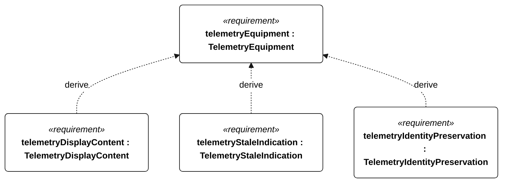
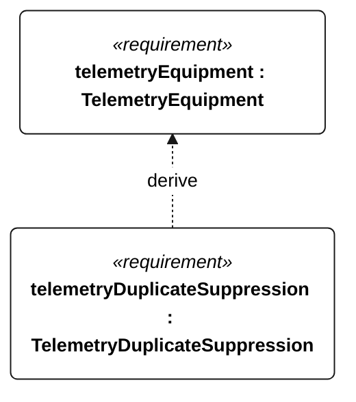

# C-101 telemetry equipment

[All requirement views](<../requirements-views.md>)

**TelemetryEquipment** — Aggregate requirement for TelemetryEquipment. Acceptance requires all applicable derived leaf results (C-201, C-202, C-203, C-204); this parent has no independent executable pass/fail predicate. Shared verification context: Freshness threshold is 120 seconds for normal, emergency, powered recovery or unknown mode, and 600 seconds only for explicitly reported low energy without emergency or powered recovery. Staleness describes data age, not diagnosed link failure. Exercise a 24-hour outage and reconnection.

**TelemetryDisplayContent** — The shore endpoint shall display UTC sample time, position, mode, conservative usable energy, reserve, faults and age from each current telemetry record. Verification uses the shared context of C-101.

**TelemetryStaleIndication** — The shore endpoint shall indicate stale data when record age exceeds its C-101 mode threshold until receipt of a record within its applicable threshold. Verification uses the shared context of C-101.

**TelemetryIdentityPreservation** — The shore endpoint shall preserve received record identity and sequence numbers across the C-101 outage/reconnection test. Verification uses the shared context of C-101.

**TelemetryDuplicateSuppression** — The shore endpoint shall not present a duplicate telemetry record as a new observation. Verification uses the shared context of C-101.

## C-101 derivation 1

## C-101 derivation 2

