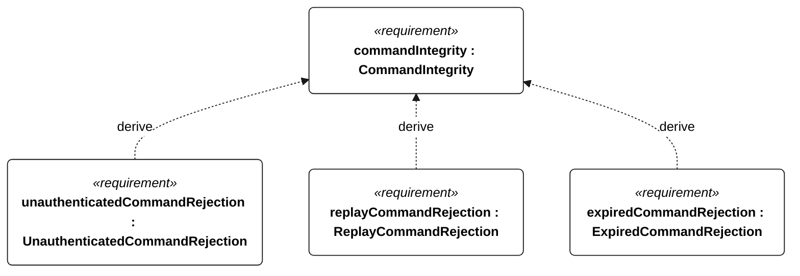
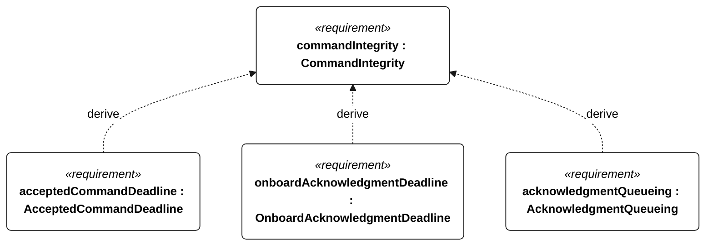
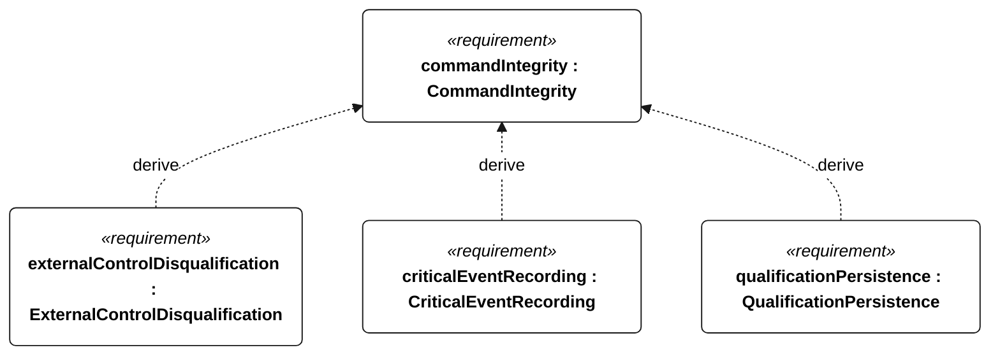

# C-102 command integrity

<!-- Generated from SysML by scripts/render_requirements.py; edit the model, not this file. -->

[All requirement views](<../requirements-views.md>)

[Qualification conditions, rationale, open issues and verification](<../requirements-context.md>)

**C-102 CommandIntegrity** — The vessel shall accept external commands only under the specified authentication, freshness and qualification rules.

**C-205 UnauthenticatedCommandRejection** — Commands failing authentication shall cause zero accepted actuator or mission-state changes.

**C-206 ReplayCommandRejection** — Commands with previously used sequence numbers shall cause zero accepted actuator or mission-state changes.

**C-207 ExpiredCommandRejection** — Commands older than 30 seconds shall cause zero accepted actuator or mission-state changes.

**C-208 AcceptedCommandDeadline** — An accepted abort or mode-change command shall be applied within 1 second of complete receipt.

**C-209 OnboardAcknowledgmentDeadline** — An accepted abort or mode-change command shall be acknowledged onboard within 1 second of complete receipt.

**C-210 AcknowledgmentQueueing** — An accepted command acknowledgment shall enter the transmit queue in the same command-processing cycle when a link is available.

**C-211 ExternalControlDisqualification** — Acceptance of external mission or steering control during a qualifying attempt shall permanently disqualify that attempt.

**E-132 CriticalEventRecording** — Every external-command disposition, reset, motor-enable transition, ingress detection, recovery request, navigation-degraded transition, low-energy flag transition and qualification change shall have an event record regardless of periodic cadence.

**E-138 QualificationPersistence** — Each disqualifying transition shall be durably stored before its associated commanded intervention or motor enable.

## C-102 derivation 1

## C-102 derivation 2

## C-102 derivation 3

