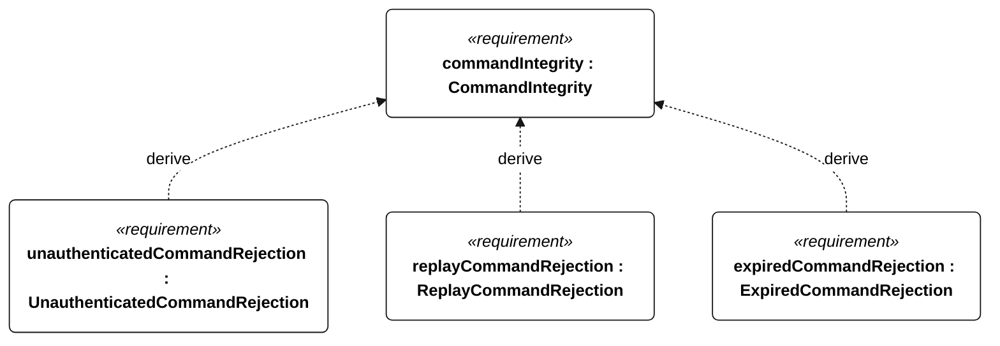
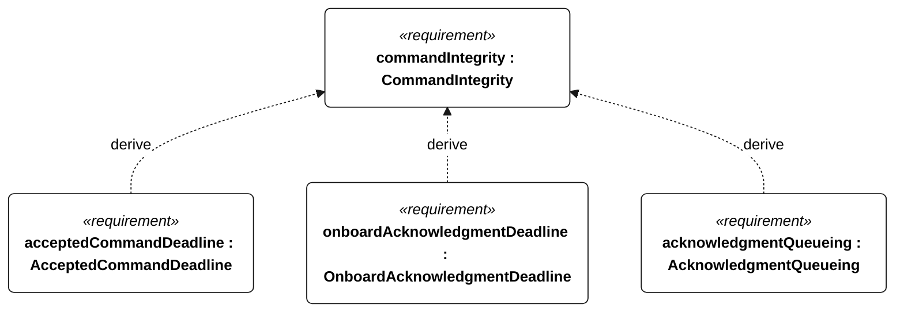
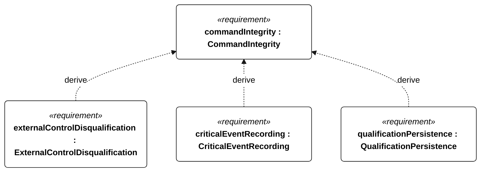

# C-102 command integrity

[All requirement views](<../requirements-views.md>)

**CommandIntegrity** — Aggregate requirement for CommandIntegrity. Acceptance requires all applicable derived leaf results (C-205, C-206, C-207, C-208, C-209, C-210, C-211, E-132, E-138); this parent has no independent executable pass/fail predicate. Shared verification context: Exercise complete command receipt, authentication failure, replayed sequence numbers, age greater than 30 seconds, and external control during a qualifying attempt.

**UnauthenticatedCommandRejection** — Commands failing authentication shall cause zero accepted actuator or mission-state changes. Verification uses the shared context of C-102.

**ReplayCommandRejection** — Commands with previously used sequence numbers shall cause zero accepted actuator or mission-state changes. Verification uses the shared context of C-102.

**ExpiredCommandRejection** — Commands older than 30 seconds shall cause zero accepted actuator or mission-state changes. Verification uses the shared context of C-102.

**AcceptedCommandDeadline** — An accepted abort or mode-change command shall be applied within 1 second of complete receipt. Verification uses the shared context of C-102.

**OnboardAcknowledgmentDeadline** — An accepted abort or mode-change command shall be acknowledged onboard within 1 second of complete receipt. Verification uses the shared context of C-102.

**AcknowledgmentQueueing** — An accepted command acknowledgment shall enter the transmit queue in the same command-processing cycle when a link is available. Verification uses the shared context of C-102.

**ExternalControlDisqualification** — Acceptance of external mission or steering control during a qualifying attempt shall permanently disqualify that attempt. Verification uses the shared context of C-102.

**CriticalEventRecording** — Every external-command disposition, reset, motor-enable transition, ingress detection, recovery request, navigation-degraded transition, low-energy flag transition and qualification change shall have an event record regardless of periodic cadence. Verification uses the shared context of E-007.

**QualificationPersistence** — Each disqualifying transition shall be durably stored before its associated commanded intervention or motor enable. Verification uses the shared context of E-007.

## C-102 derivation 1

## C-102 derivation 2

## C-102 derivation 3

