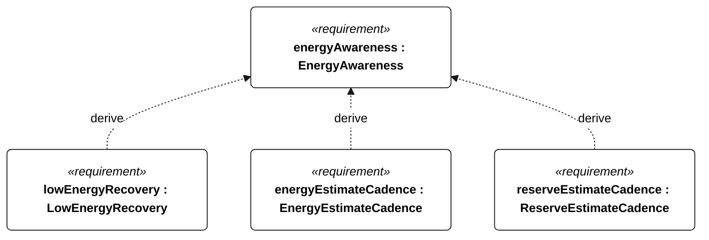
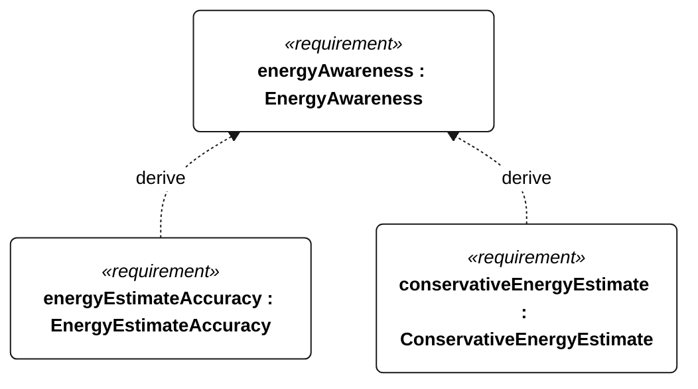

# E-001 energy awareness

[All requirement views](<../requirements-views.md>)

**EnergyAwareness** — Aggregate requirement for EnergyAwareness. Acceptance requires all applicable derived leaf results (E-101, E-102, E-103, E-104); this parent has no independent executable pass/fail predicate. Shared verification context: Energy estimation and conservative decision inputs; accuracy uses calibrated energy integration across operating battery temperatures.

**LowEnergyRecovery** — Aggregate requirement for LowEnergyRecovery. Acceptance requires all applicable derived leaf results (E-114, E-115, E-116, E-117, E-118, E-119, E-130, E-120, E-132, R-101); this parent has no independent executable pass/fail predicate. Shared verification context: Reserve means R-002. Emergency/recovery cadence takes precedence; clearing low-energy state is independent of other modes, while payload enabling respects all restrictions.

**EnergyEstimateCadence** — The vessel shall refresh usable battery-energy estimates at least once per second. Verification uses the shared context of E-001.

**ReserveEstimateCadence** — The vessel shall refresh protected recovery-reserve estimates at least once per second. Verification uses the shared context of E-001.

**EnergyEstimateAccuracy** — Usable-energy estimation error shall not exceed 10 percent of measured usable full-charge energy relative to calibrated charge/discharge integration across operating battery temperatures. Verification uses the shared context of E-001.

**ConservativeEnergyEstimate** — The usable-energy input to admission and low-energy decisions shall equal estimated usable energy minus the EnergyEstimateAccuracy error allowance. Verification uses the shared context of E-001.

## E-001 derivation 1

## E-001 derivation 2

[Continue: E-004 low energy recovery](<requirements-e-004.md>)
