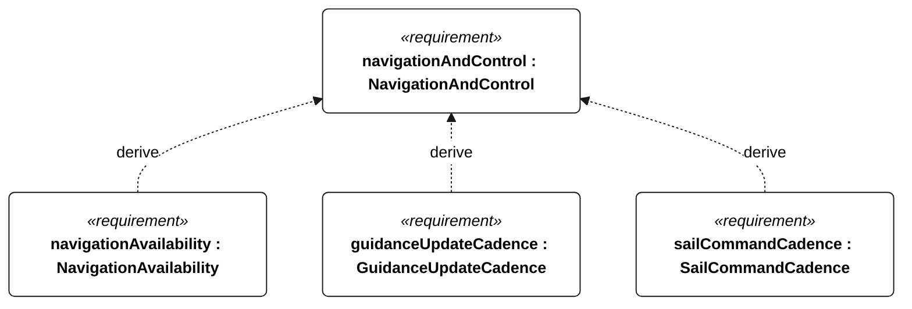
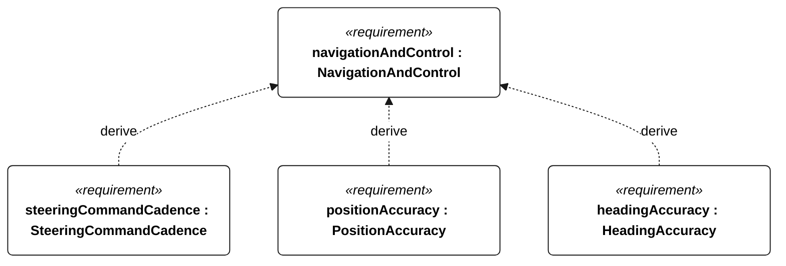

# E-002 NavigationAndControl relationships

<!-- Generated from SysML by scripts/render_requirements.py; edit the model, not this file. -->

[All requirement views](<../requirements-views.md>)

[Conditions, rationale and verification](<../requirements-context.md>)

**E-002 NavigationAndControl** — The vessel shall provide autonomous navigation and sail/steering control within the selected operational profile.

**E-008 NavigationAvailability** — The vessel shall maintain valid navigation inputs and reject stale observations.

**E-105 GuidanceUpdateCadence** — During operational qualification, mission guidance shall update at least once per second.

**E-106 SailCommandCadence** — During operational qualification, commanded sail position shall update at least once per second.

**E-107 SteeringCommandCadence** — During operational qualification, commanded steering position shall update at least once per second.

**E-108 PositionAccuracy** — At every epoch in the common E-002 acceptance set, valid position error shall be at most 10 m against an independent reference.

**E-109 HeadingAccuracy** — At every epoch in the common E-002 acceptance set, valid heading error shall be at most 10 degrees against an independent reference.

## E-002 relationships 1

## E-002 relationships 2

## Design decisions motivated by this requirement

Plain dependencies record design basis, not derivation or refinement. The native GeneralView renderer does not draw these dependencies; their actual endpoints and rationale are reported here.

| Dependent requirement | Design basis | Rationale |
| --- | --- | --- |
| trafficSafety | navigationAndControl | TrafficSafety supports navigationAndControl. This is design motivation or an implementation choice, not a satisfaction implication. |

[Continue: E-008 NavigationAvailability](<requirements-e-008.md>)

[Continue: S-001 TrafficSafety](<requirements-s-001.md>)
