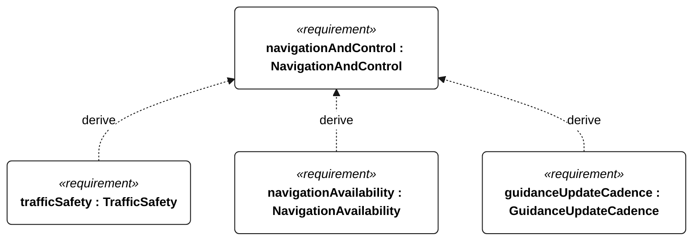
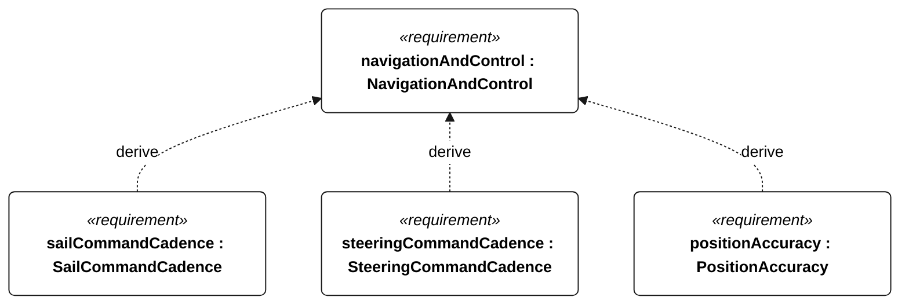
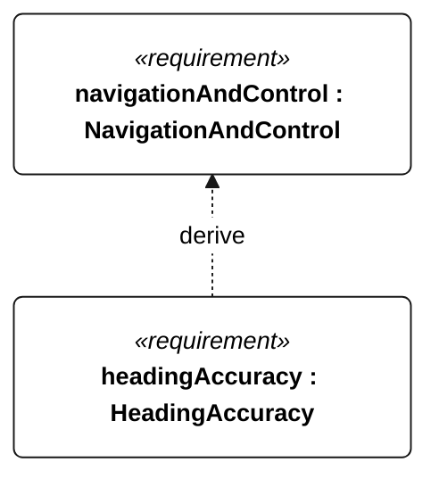

# E-002 navigation and control

[All requirement views](<../requirements-views.md>)

[Qualification conditions, rationale, open issues and verification](<../requirements-context.md>)

**E-002 NavigationAndControl** — The vessel shall provide autonomous navigation and sail/steering control within the selected operational profile.

**S-001 TrafficSafety** — The vessel shall assess and respond to collision risks within the deployment-specific traffic envelope.

**E-008 NavigationAvailability** — The vessel shall maintain valid navigation inputs and reject stale observations.

**E-105 GuidanceUpdateCadence** — During operational qualification, mission guidance shall update at least once per second.

**E-106 SailCommandCadence** — During operational qualification, commanded sail position shall update at least once per second.

**E-107 SteeringCommandCadence** — During operational qualification, commanded steering position shall update at least once per second.

**E-108 PositionAccuracy** — At every epoch in the common E-002 acceptance set, valid position error shall be at most 10 m against an independent reference.

**E-109 HeadingAccuracy** — At every epoch in the common E-002 acceptance set, valid heading error shall be at most 10 degrees against an independent reference.

## E-002 derivation 1

## E-002 derivation 2

## E-002 derivation 3

[Continue: S-001 traffic safety](<requirements-s-001.md>)

[Continue: E-008 navigation availability](<requirements-e-008.md>)
