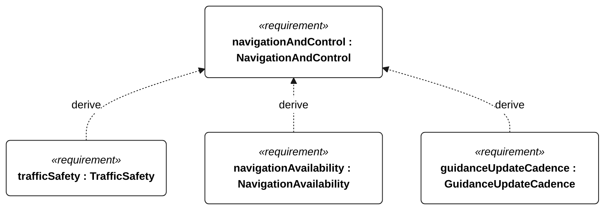
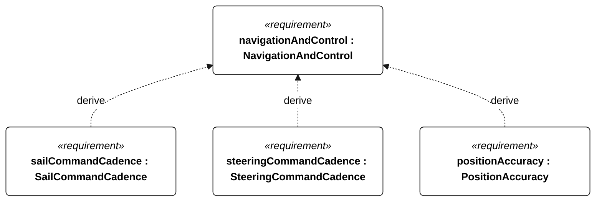
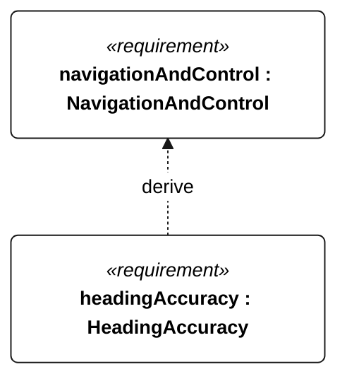

# E-002 navigation and control

[All requirement views](<../requirements-views.md>)

**NavigationAndControl** — Aggregate requirement for NavigationAndControl. Acceptance requires all applicable derived leaf results (E-105, E-106, E-107, E-108, E-109); this parent has no independent executable pass/fail predicate. Shared verification context: Qualification uses the selected mission profile. Accuracy trials contain 1800 scheduled one-second epochs in 30 minutes; invalid or missing epochs fail. Position and heading criteria use the same set of at least 1710 qualifying epochs, preventing separate selection of different good samples. Fault-injection runs are separate.

**TrafficSafety** — Aggregate requirement for TrafficSafety. Acceptance requires all applicable derived leaf results (S-101, S-102, S-103, S-104); this parent has no independent executable pass/fail predicate. Shared verification context: Use independently recorded head-on, crossing and overtaking AIS and non-AIS targets, day and night in the selected operational profile. Detection ranges, target signatures, closest-approach margins and maneuver feasibility remain unresolved acceptance parameters; tracking and avoidance cannot receive complete passes until these are frozen.

**NavigationAvailability** — Aggregate requirement for NavigationAvailability. Acceptance requires all applicable derived leaf results (E-140, E-141, E-142, E-143, E-132); this parent has no independent executable pass/fail predicate. Shared verification context: Campaigns use 1800 scheduled one-second epochs in 30 minutes, with missing/invalid epochs counted as failures. Fault injection is separate.

**GuidanceUpdateCadence** — During operational qualification, mission guidance shall update at least once per second. Verification uses the shared context of E-002.

**SailCommandCadence** — During operational qualification, commanded sail position shall update at least once per second. Verification uses the shared context of E-002.

**SteeringCommandCadence** — During operational qualification, commanded steering position shall update at least once per second. Verification uses the shared context of E-002.

**PositionAccuracy** — At every epoch in the common E-002 acceptance set, valid position error shall be at most 10 m against an independent reference. Verification uses the shared context of E-002.

**HeadingAccuracy** — At every epoch in the common E-002 acceptance set, valid heading error shall be at most 10 degrees against an independent reference. Verification uses the shared context of E-002.

## E-002 derivation 1

## E-002 derivation 2

## E-002 derivation 3

[Continue: S-001 traffic safety](<requirements-s-001.md>)

[Continue: E-008 navigation availability](<requirements-e-008.md>)
