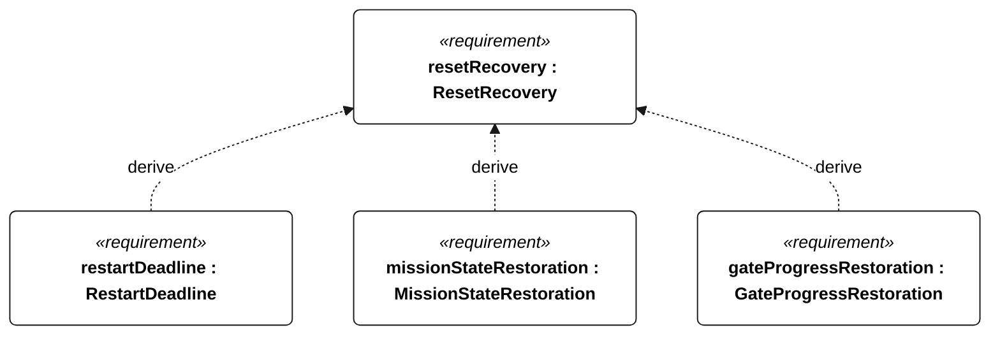
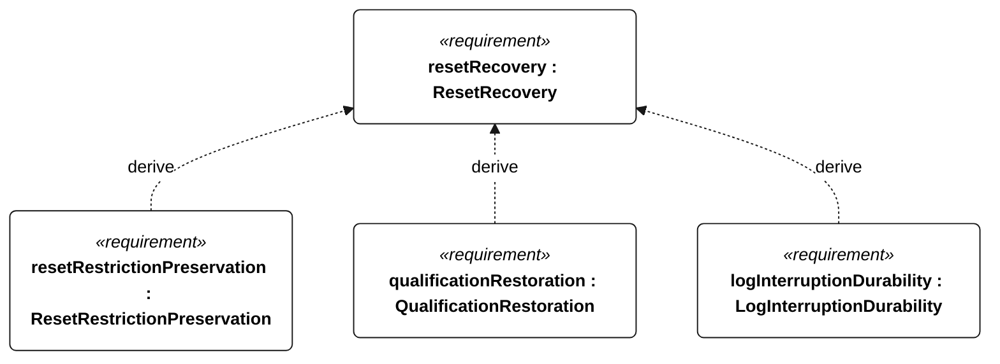
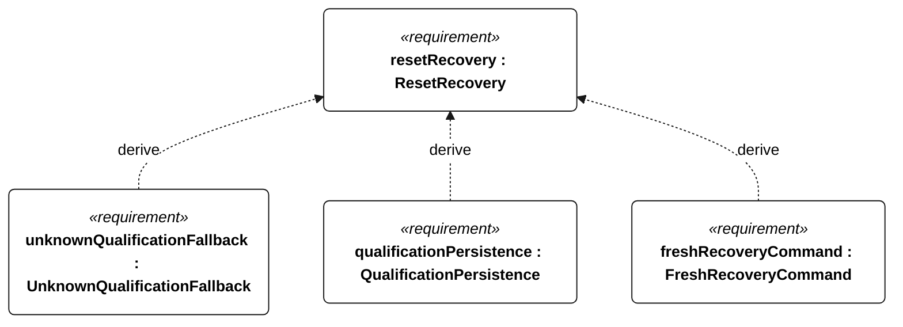
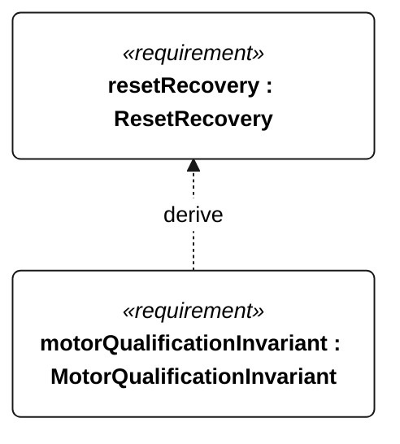

# E-003 reset recovery

<!-- Generated from SysML by scripts/render_requirements.py; edit the model, not this file. -->

[All requirement views](<../requirements-views.md>)

[Qualification conditions, rationale, open issues and verification](<../requirements-context.md>)

**E-003 ResetRecovery** — The vessel shall restore mode-appropriate autonomous operation after a watchdog reset.

**E-110 RestartDeadline** — After a watchdog reset under E-003 preconditions, the vessel shall restore mode-appropriate autonomous control within 30 seconds.

**E-111 MissionStateRestoration** — Within 30 seconds after a watchdog reset under E-003 preconditions, restored mission mode shall equal the last persisted mode.

**E-112 GateProgressRestoration** — Within 30 seconds after a watchdog reset under E-003 preconditions, restored gate progress shall equal the last persisted gate progress.

**E-113 ResetRestrictionPreservation** — After watchdog reset, each active survival, low-energy, recovery and isolation restriction shall remain effective until its own release condition is met.

**E-145 QualificationRestoration** — Within 30 seconds after a watchdog reset under E-003 preconditions, qualification status shall equal the valid persisted status, or be nonqualifying when persisted status is absent or inconsistent.

**E-136 LogInterruptionDurability** — After watchdog reset or abrupt power removal, every record older than 5 seconds before interruption shall remain readable.

**E-139 UnknownQualificationFallback** — On restart with absent or inconsistent persisted qualification state, the vessel shall adopt nonqualifying status.

**E-138 QualificationPersistence** — Each disqualifying transition shall be durably stored before its associated commanded intervention or motor enable.

**R-102 FreshRecoveryCommand** — After restart, motor enable shall remain inhibited until a fresh authenticated recovery command is accepted.

**R-101 MotorQualificationInvariant** — Motor thrust shall remain disabled whenever an attempt is qualifying or qualification status is unknown.

## E-003 derivation 1

## E-003 derivation 2

## E-003 derivation 3

## E-003 derivation 4

