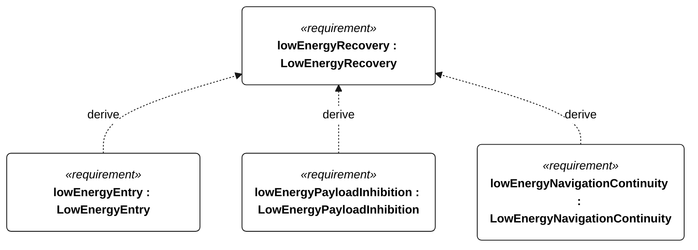
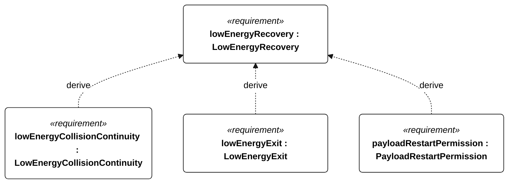
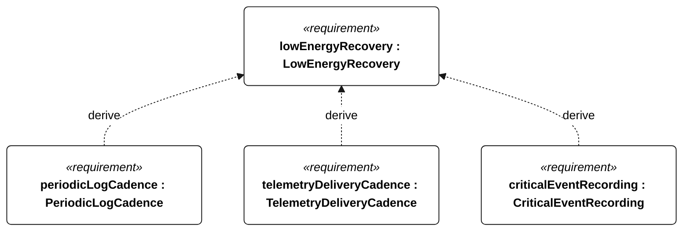
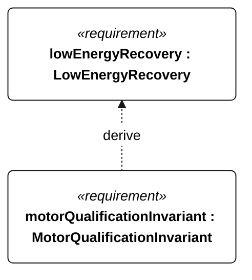

# E-004 low energy recovery

[All requirement views](<../requirements-views.md>)

**LowEnergyRecovery** — Aggregate requirement for LowEnergyRecovery. Acceptance requires all applicable derived leaf results (E-114, E-115, E-116, E-117, E-118, E-119, E-130, E-120, E-132, R-101); this parent has no independent executable pass/fail predicate. Shared verification context: Reserve means R-002. Emergency/recovery cadence takes precedence; clearing low-energy state is independent of other modes, while payload enabling respects all restrictions.

**LowEnergyEntry** — When conservative usable energy reaches or falls below protected reserve, the vessel shall set the low-energy flag within 5 seconds. Verification uses the shared context of E-004.

**LowEnergyPayloadInhibition** — While the low-energy flag is set, the optional observation payload shall be disabled. Verification uses the shared context of E-004.

**LowEnergyNavigationContinuity** — While the low-energy flag is set, autonomous navigation shall remain active. Verification uses the shared context of E-004.

**LowEnergyCollisionContinuity** — While the low-energy flag is set, collision-response behavior shall remain active. Verification uses the shared context of E-004.

**LowEnergyExit** — After conservative usable energy exceeds 1.2 times protected reserve for 10 continuous minutes, the vessel shall clear the low-energy flag independently of survival/recovery flags. Verification uses the shared context of E-004.

**PayloadRestartPermission** — Payload operation shall remain inhibited whenever a low-energy, survival or recovery restriction is active. Verification uses the shared context of E-004.

**PeriodicLogCadence** — Periodic mission records shall be acquired at least once per second normally and once per minute in low-energy or survival operation. Verification uses the shared context of E-007.

**TelemetryDeliveryCadence** — With a functioning link, current telemetry delivery intervals shall not exceed 60 seconds, except that low-energy operation without emergency/powered recovery permits 300 seconds. Verification uses the shared context of E-005.

**CriticalEventRecording** — Every external-command disposition, reset, motor-enable transition, ingress detection, recovery request, navigation-degraded transition, low-energy flag transition and qualification change shall have an event record regardless of periodic cadence. Verification uses the shared context of E-007.

**MotorQualificationInvariant** — Motor thrust shall remain disabled whenever an attempt is qualifying or qualification status is unknown. Verification uses the shared context of R-004.

## E-004 derivation 1

## E-004 derivation 2

## E-004 derivation 3

## E-004 derivation 4

