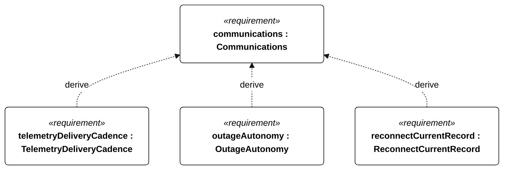
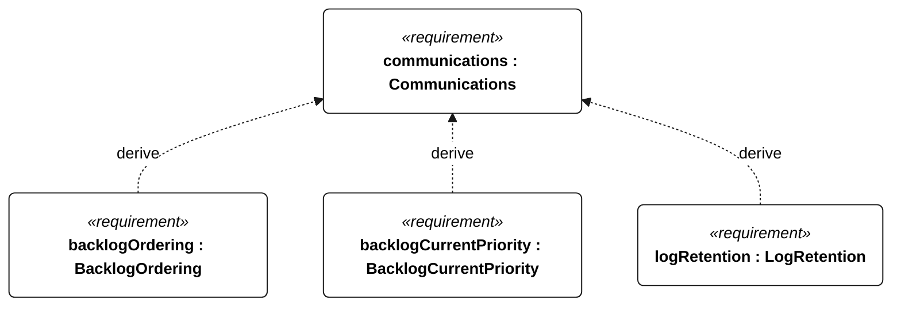
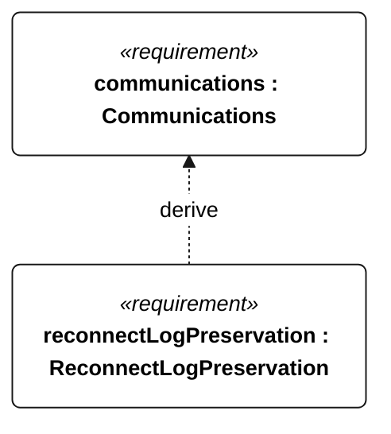

# E-005 Communications relationships

<!-- Generated from SysML by scripts/render_requirements.py; edit the model, not this file. -->

[All requirement views](<../requirements-views.md>)

[Conditions, rationale and verification](<../requirements-context.md>)

**E-005 Communications** — The vessel shall support live telemetry through link outages and reconnection.

**E-120 TelemetryDeliveryCadence** — With a functioning link, current telemetry delivery intervals shall not exceed 60 seconds, except that low-energy operation without emergency/powered recovery permits 300 seconds.

**E-121 OutageAutonomy** — Through a 24-hour telemetry-link outage, autonomous mission control shall continue without operator intervention.

**E-122 ReconnectCurrentRecord** — After link restoration, a current telemetry record shall arrive within the active TelemetryDeliveryCadence interval.

**E-123 BacklogOrdering** — After reconnection, retained backlog records shall be transmitted in ascending acquisition sequence order.

**E-124 BacklogCurrentPriority** — During backlog transfer, current telemetry shall continue to meet TelemetryDeliveryCadence.

**E-131 LogRetention** — Acquired mission records shall remain retrievable onboard for at least 30 days.

**E-137 ReconnectLogPreservation** — Communication reconnection shall not delete retained mission records.

## E-005 relationships 1

## E-005 relationships 2

## E-005 relationships 3

## Design decisions motivated by this requirement

Plain dependencies record design basis, not derivation or refinement. The native GeneralView renderer does not draw these dependencies; their actual endpoints and rationale are reported here.

| Dependent requirement | Design basis | Rationale |
| --- | --- | --- |
| telemetryEquipment | communications | TelemetryEquipment supports communications. This is design motivation or an implementation choice, not a satisfaction implication. |
| commandIntegrity | communications | CommandIntegrity supports communications. This is design motivation or an implementation choice, not a satisfaction implication. |

[Continue: C-102 CommandIntegrity](<requirements-c-102.md>)

[Continue: C-101 TelemetryEquipment](<requirements-c-101.md>)
