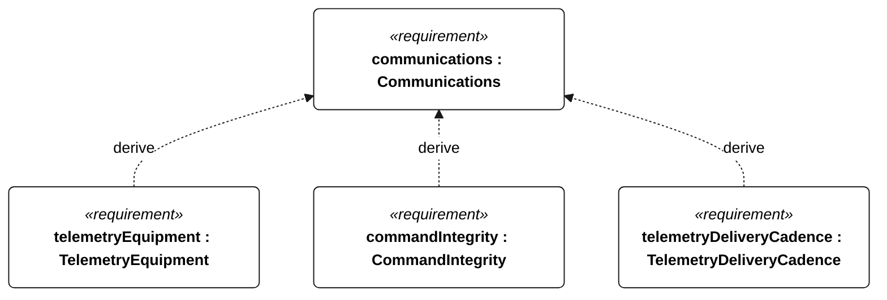
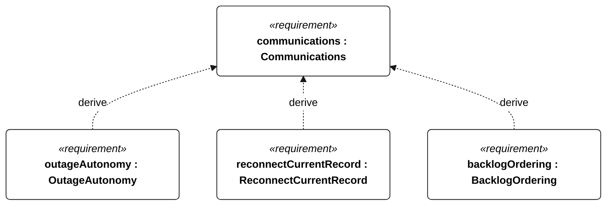
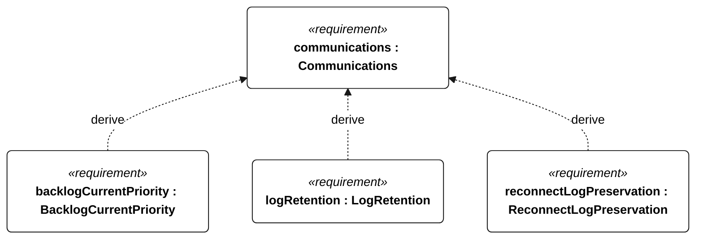

# E-005 communications

[All requirement views](<../requirements-views.md>)

**Communications** — Aggregate requirement for Communications. Acceptance requires all applicable derived leaf results (E-120, E-121, E-122, E-123, E-124, E-131, E-137); this parent has no independent executable pass/fail predicate. Shared verification context: Link availability is a delivery-test precondition, not a coverage guarantee. Normal cadence is 60 seconds; low-energy alone permits 300 seconds; emergency/powered recovery takes precedence at 60 seconds. Outage tests last 24 hours.

**TelemetryEquipment** — Aggregate requirement for TelemetryEquipment. Acceptance requires all applicable derived leaf results (C-201, C-202, C-203, C-204); this parent has no independent executable pass/fail predicate. Shared verification context: Freshness threshold is 120 seconds for normal, emergency, powered recovery or unknown mode, and 600 seconds only for explicitly reported low energy without emergency or powered recovery. Staleness describes data age, not diagnosed link failure. Exercise a 24-hour outage and reconnection.

**CommandIntegrity** — Aggregate requirement for CommandIntegrity. Acceptance requires all applicable derived leaf results (C-205, C-206, C-207, C-208, C-209, C-210, C-211, E-132, E-138); this parent has no independent executable pass/fail predicate. Shared verification context: Exercise complete command receipt, authentication failure, replayed sequence numbers, age greater than 30 seconds, and external control during a qualifying attempt.

**TelemetryDeliveryCadence** — With a functioning link, current telemetry delivery intervals shall not exceed 60 seconds, except that low-energy operation without emergency/powered recovery permits 300 seconds. Verification uses the shared context of E-005.

**OutageAutonomy** — Through a 24-hour telemetry-link outage, autonomous mission control shall continue without operator intervention. Verification uses the shared context of E-005.

**ReconnectCurrentRecord** — After link restoration, a current telemetry record shall arrive within the active TelemetryDeliveryCadence interval. Verification uses the shared context of E-005.

**BacklogOrdering** — After reconnection, retained backlog records shall be transmitted in ascending acquisition sequence order. Verification uses the shared context of E-005.

**BacklogCurrentPriority** — During backlog transfer, current telemetry shall continue to meet TelemetryDeliveryCadence. Verification uses the shared context of E-005.

**LogRetention** — Acquired mission records shall remain retrievable onboard for at least 30 days. Verification uses the shared context of E-007.

**ReconnectLogPreservation** — Communication reconnection shall not delete retained mission records. Verification uses the shared context of E-007.

## E-005 derivation 1

## E-005 derivation 2

## E-005 derivation 3

[Continue: C-101 telemetry equipment](<requirements-c-101.md>)

[Continue: C-102 command integrity](<requirements-c-102.md>)
