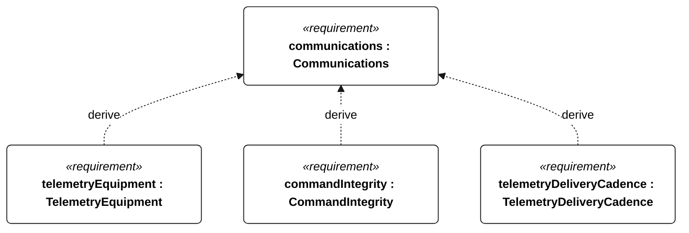
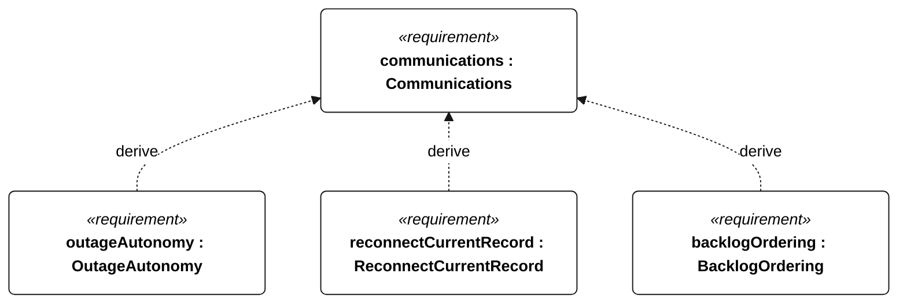
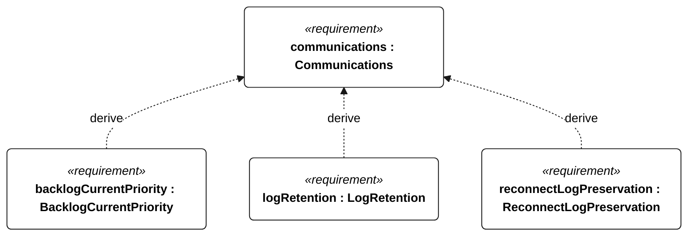

# E-005 communications

<!-- Generated from SysML by scripts/render_requirements.py; edit the model, not this file. -->

[All requirement views](<../requirements-views.md>)

[Qualification conditions, rationale, open issues and verification](<../requirements-context.md>)

**E-005 Communications** — The vessel shall support live telemetry through link outages and reconnection.

**C-101 TelemetryEquipment** — The shore endpoint shall present current vessel telemetry with explicit data age and identity.

**C-102 CommandIntegrity** — The vessel shall accept external commands only under the specified authentication, freshness and qualification rules.

**E-120 TelemetryDeliveryCadence** — With a functioning link, current telemetry delivery intervals shall not exceed 60 seconds, except that low-energy operation without emergency/powered recovery permits 300 seconds.

**E-121 OutageAutonomy** — Through a 24-hour telemetry-link outage, autonomous mission control shall continue without operator intervention.

**E-122 ReconnectCurrentRecord** — After link restoration, a current telemetry record shall arrive within the active TelemetryDeliveryCadence interval.

**E-123 BacklogOrdering** — After reconnection, retained backlog records shall be transmitted in ascending acquisition sequence order.

**E-124 BacklogCurrentPriority** — During backlog transfer, current telemetry shall continue to meet TelemetryDeliveryCadence.

**E-131 LogRetention** — Acquired mission records shall remain retrievable onboard for at least 30 days.

**E-137 ReconnectLogPreservation** — Communication reconnection shall not delete retained mission records.

## E-005 derivation 1

## E-005 derivation 2

## E-005 derivation 3

[Continue: C-101 telemetry equipment](<requirements-c-101.md>)

[Continue: C-102 command integrity](<requirements-c-102.md>)
