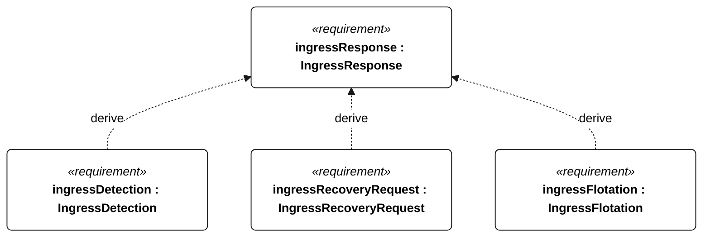
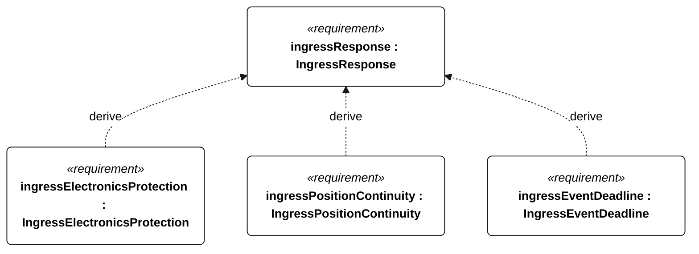
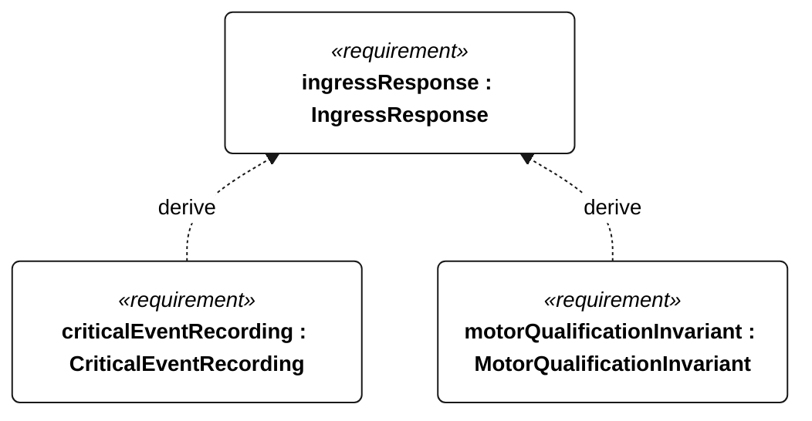

# E-006 ingress response

[All requirement views](<../requirements-views.md>)

**IngressResponse** — Aggregate requirement for IngressResponse. Acceptance requires all applicable derived leaf results (E-125, E-126, E-127, E-128, E-129, E-144, E-132, R-101); this parent has no independent executable pass/fail predicate. Shared verification context: All leaves use a 30-minute freshwater injection at 10 mL/min into the normally dry hull. No pump technology is prescribed; R-004 remains applicable.

**IngressDetection** — In the E-006 injection test, ingress detection shall occur within 60 seconds of injection starting. Verification uses the shared context of E-006.

**IngressRecoveryRequest** — In the E-006 test, ingress detection shall set the recovery-request state. Verification uses the shared context of E-006.

**IngressFlotation** — In the E-006 test, the vessel shall remain afloat for the full 30 minutes. Verification uses the shared context of E-006.

**IngressElectronicsProtection** — After the E-006 test, enclosed-electronics water-sensitive indicators shall show no liquid ingress. Verification uses the shared context of E-006.

**IngressPositionContinuity** — Throughout the E-006 test with a functioning link, position reporting shall meet the active TelemetryDeliveryCadence. Verification uses the shared context of E-006.

**IngressEventDeadline** — In the E-006 injection test, an ingress event record shall exist within 60 seconds of injection starting. Verification uses the shared context of E-006.

**CriticalEventRecording** — Every external-command disposition, reset, motor-enable transition, ingress detection, recovery request, navigation-degraded transition, low-energy flag transition and qualification change shall have an event record regardless of periodic cadence. Verification uses the shared context of E-007.

**MotorQualificationInvariant** — Motor thrust shall remain disabled whenever an attempt is qualifying or qualification status is unknown. Verification uses the shared context of R-004.

## E-006 derivation 1

## E-006 derivation 2

## E-006 derivation 3

