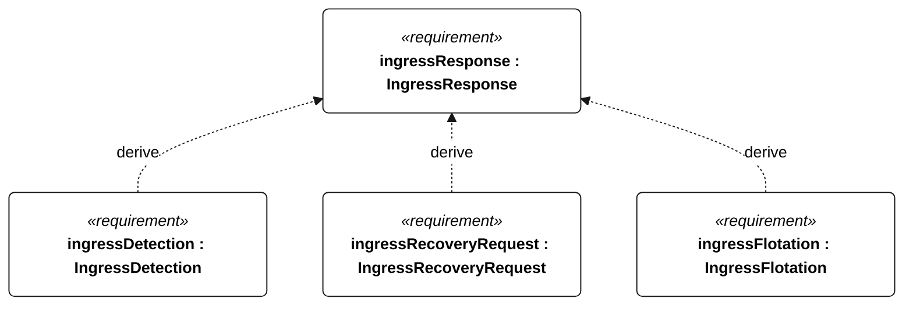
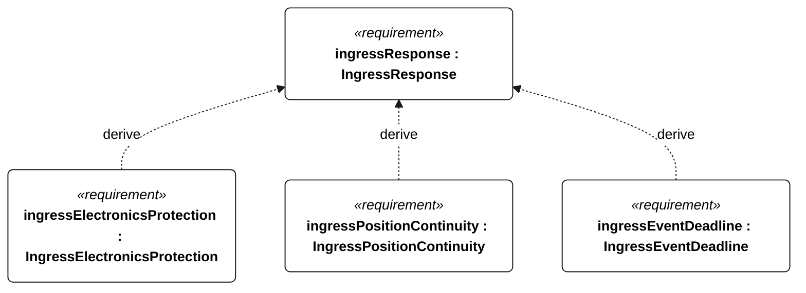
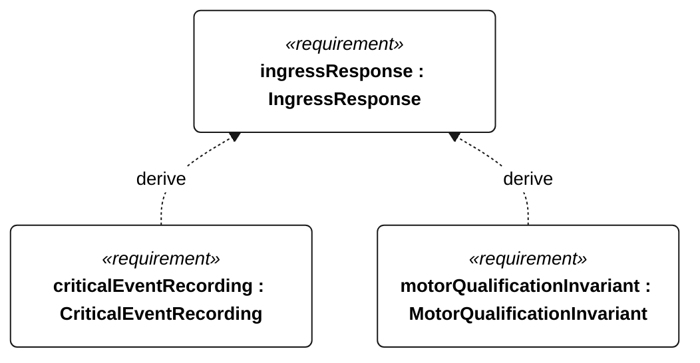

# E-006 IngressResponse relationships

<!-- Generated from SysML by scripts/render_requirements.py; edit the model, not this file. -->

[All requirement views](<../requirements-views.md>)

[Conditions, rationale and verification](<../requirements-context.md>)

**E-006 IngressResponse** — The vessel shall retain recoverability during the specified hull-ingress qualification.

**E-125 IngressDetection** — In the E-006 injection test, ingress detection shall occur within 60 seconds of injection starting.

**E-126 IngressRecoveryRequest** — In the E-006 test, ingress detection shall set the recovery-request state.

**E-127 IngressFlotation** — In the E-006 test, the vessel shall remain afloat for the full 30 minutes.

**E-128 IngressElectronicsProtection** — After the E-006 test, enclosed-electronics water-sensitive indicators shall show no liquid ingress.

**E-129 IngressPositionContinuity** — Throughout the E-006 test with a functioning link, position reporting shall meet the active TelemetryDeliveryCadence.

**E-144 IngressEventDeadline** — In the E-006 injection test, an ingress event record shall exist within 60 seconds of injection starting.

**E-132 CriticalEventRecording** — Every external-command disposition, reset, motor-enable transition, ingress detection, recovery request, navigation-degraded transition, low-energy flag transition and qualification change shall have an event record regardless of periodic cadence.

**R-101 MotorQualificationInvariant** — Motor thrust shall remain disabled whenever an attempt is qualifying or qualification status is unknown.

## E-006 relationships 1

## E-006 relationships 2

## E-006 relationships 3

