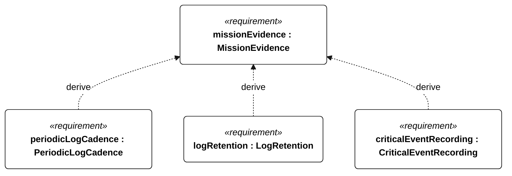
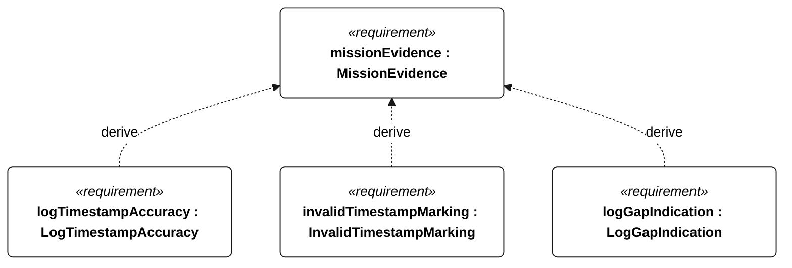
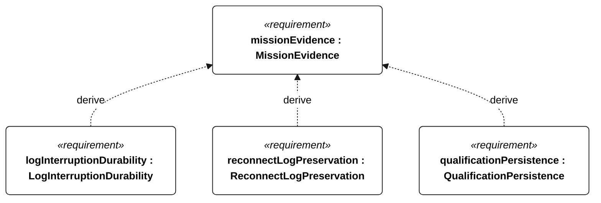
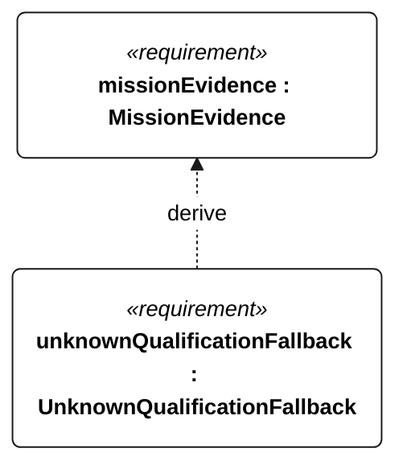

# E-007 mission evidence

[All requirement views](<../requirements-views.md>)

[Qualification conditions, rationale, open issues and verification](<../requirements-context.md>)

**E-007 MissionEvidence** — The vessel shall retain time-correlated mission evidence through communication and power interruptions.

**E-130 PeriodicLogCadence** — Periodic mission records shall be acquired at least once per second normally and once per minute in low-energy or survival operation.

**E-131 LogRetention** — Acquired mission records shall remain retrievable onboard for at least 30 days.

**E-132 CriticalEventRecording** — Every external-command disposition, reset, motor-enable transition, ingress detection, recovery request, navigation-degraded transition, low-energy flag transition and qualification change shall have an event record regardless of periodic cadence.

**E-133 LogTimestampAccuracy** — With valid GNSS time, mission-record timestamps shall differ from reference UTC by at most 1 second.

**E-134 InvalidTimestampMarking** — Each record acquired without valid time shall carry an invalid-time indication.

**E-135 LogGapIndication** — Each detected missing sequence of scheduled records shall have a gap indication in retrieved data.

**E-136 LogInterruptionDurability** — After watchdog reset or abrupt power removal, every record older than 5 seconds before interruption shall remain readable.

**E-137 ReconnectLogPreservation** — Communication reconnection shall not delete retained mission records.

**E-138 QualificationPersistence** — Each disqualifying transition shall be durably stored before its associated commanded intervention or motor enable.

**E-139 UnknownQualificationFallback** — On restart with absent or inconsistent persisted qualification state, the vessel shall adopt nonqualifying status.

## E-007 derivation 1

## E-007 derivation 2

## E-007 derivation 3

## E-007 derivation 4

