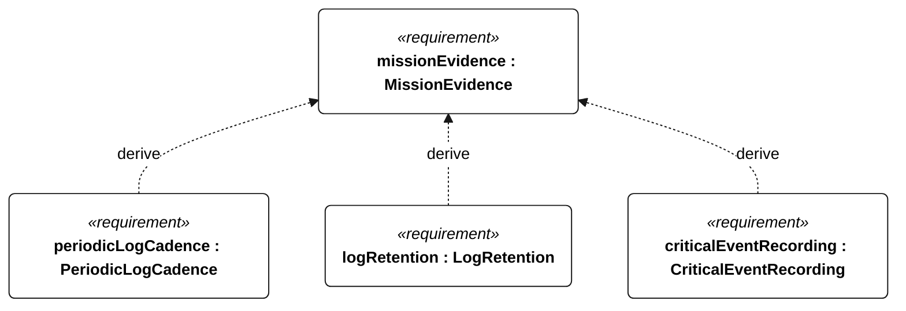
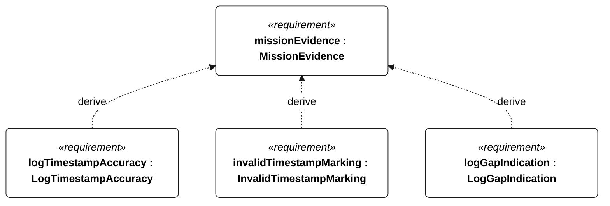
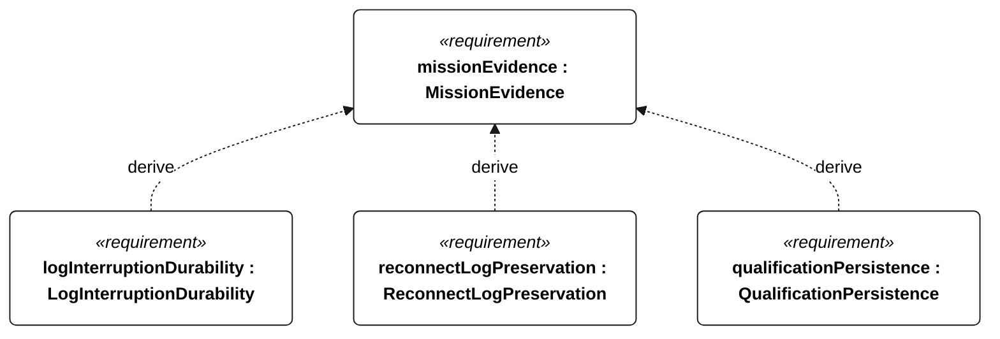
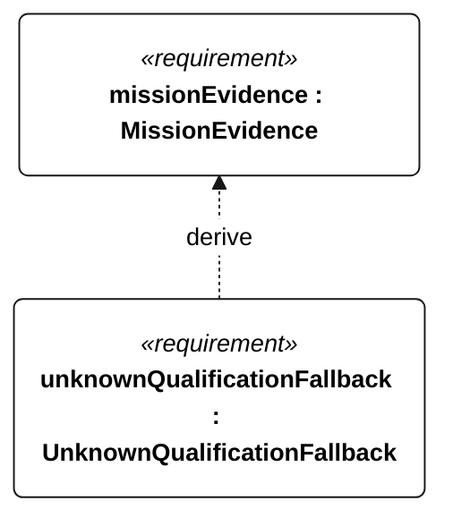

# E-007 mission evidence

[All requirement views](<../requirements-views.md>)

**MissionEvidence** — Aggregate requirement for MissionEvidence. Acceptance requires all applicable derived leaf results (E-130, E-131, E-132, E-133, E-134, E-135, E-136, E-137, E-138, E-139); this parent has no independent executable pass/fail predicate. Shared verification context: Periodic records contain position, heading, mode, gate progress, battery energy and fault state. Critical events are independent of periodic cadence. Timestamp accuracy is assessed with valid GNSS time.

**PeriodicLogCadence** — Periodic mission records shall be acquired at least once per second normally and once per minute in low-energy or survival operation. Verification uses the shared context of E-007.

**LogRetention** — Acquired mission records shall remain retrievable onboard for at least 30 days. Verification uses the shared context of E-007.

**CriticalEventRecording** — Every external-command disposition, reset, motor-enable transition, ingress detection, recovery request, navigation-degraded transition, low-energy flag transition and qualification change shall have an event record regardless of periodic cadence. Verification uses the shared context of E-007.

**LogTimestampAccuracy** — With valid GNSS time, mission-record timestamps shall differ from reference UTC by at most 1 second. Verification uses the shared context of E-007.

**InvalidTimestampMarking** — Each record acquired without valid time shall carry an invalid-time indication. Verification uses the shared context of E-007.

**LogGapIndication** — Each detected missing sequence of scheduled records shall have a gap indication in retrieved data. Verification uses the shared context of E-007.

**LogInterruptionDurability** — After watchdog reset or abrupt power removal, every record older than 5 seconds before interruption shall remain readable. Verification uses the shared context of E-007.

**ReconnectLogPreservation** — Communication reconnection shall not delete retained mission records. Verification uses the shared context of E-007.

**QualificationPersistence** — Each disqualifying transition shall be durably stored before its associated commanded intervention or motor enable. Verification uses the shared context of E-007.

**UnknownQualificationFallback** — On restart with absent or inconsistent persisted qualification state, the vessel shall adopt nonqualifying status. Verification uses the shared context of E-007.

## E-007 derivation 1

## E-007 derivation 2

## E-007 derivation 3

## E-007 derivation 4

