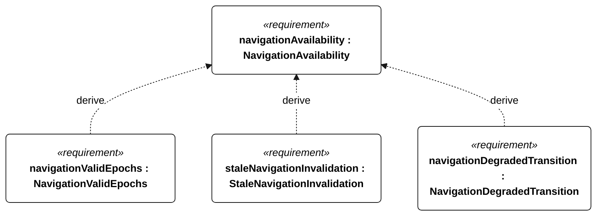
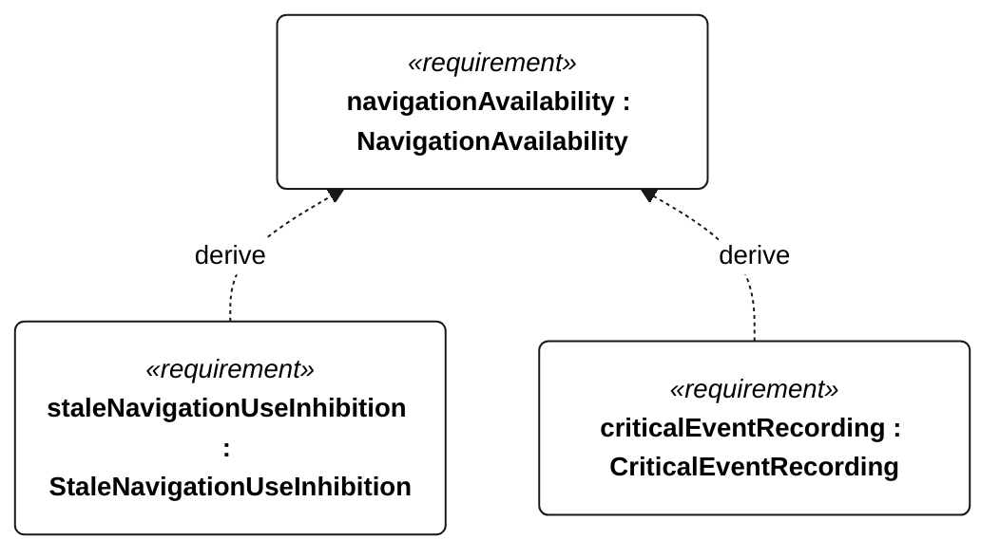

# E-008 navigation availability

[All requirement views](<../requirements-views.md>)

**NavigationAvailability** — Aggregate requirement for NavigationAvailability. Acceptance requires all applicable derived leaf results (E-140, E-141, E-142, E-143, E-132); this parent has no independent executable pass/fail predicate. Shared verification context: Campaigns use 1800 scheduled one-second epochs in 30 minutes, with missing/invalid epochs counted as failures. Fault injection is separate.

**NavigationValidEpochs** — In each E-008 campaign, at least 1710 of 1800 scheduled epochs shall contain valid position and heading observations. Verification uses the shared context of E-008.

**StaleNavigationInvalidation** — Navigation observations older than 5 seconds shall be marked invalid. Verification uses the shared context of E-008.

**NavigationDegradedTransition** — When position or heading becomes invalid due to age, the vessel shall enter navigation-degraded state within 1 second. Verification uses the shared context of E-008.

**StaleNavigationUseInhibition** — The controller shall not use observations marked invalid as current navigation inputs. Verification uses the shared context of E-008.

**CriticalEventRecording** — Every external-command disposition, reset, motor-enable transition, ingress detection, recovery request, navigation-degraded transition, low-energy flag transition and qualification change shall have an event record regardless of periodic cadence. Verification uses the shared context of E-007.

## E-008 derivation 1

## E-008 derivation 2

