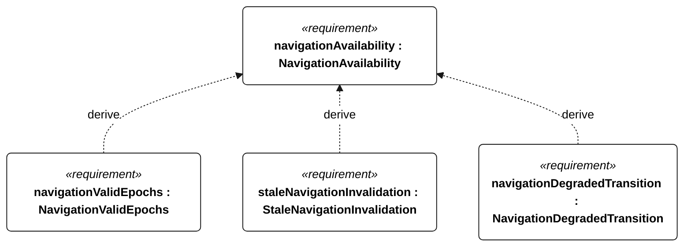
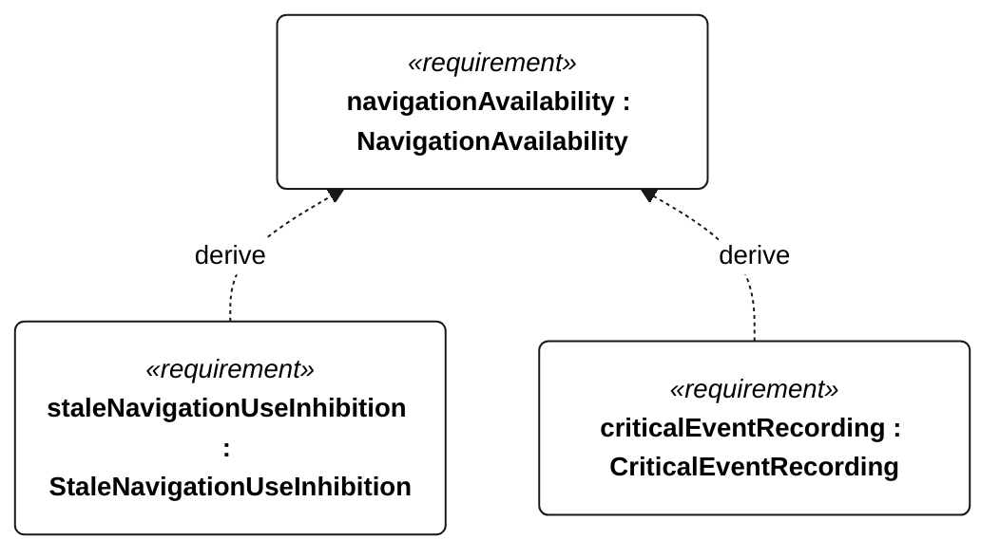

# E-008 navigation availability

[All requirement views](<../requirements-views.md>)

[Qualification conditions, rationale, open issues and verification](<../requirements-context.md>)

**E-008 NavigationAvailability** — The vessel shall maintain valid navigation inputs and reject stale observations.

**E-140 NavigationValidEpochs** — In each E-008 campaign, at least 1710 of 1800 scheduled epochs shall contain valid position and heading observations.

**E-141 StaleNavigationInvalidation** — Navigation observations older than 5 seconds shall be marked invalid.

**E-142 NavigationDegradedTransition** — When position or heading becomes invalid due to age, the vessel shall enter navigation-degraded state within 1 second.

**E-143 StaleNavigationUseInhibition** — The controller shall not use observations marked invalid as current navigation inputs.

**E-132 CriticalEventRecording** — Every external-command disposition, reset, motor-enable transition, ingress detection, recovery request, navigation-degraded transition, low-energy flag transition and qualification change shall have an event record regardless of periodic cadence.

## E-008 derivation 1

## E-008 derivation 2

