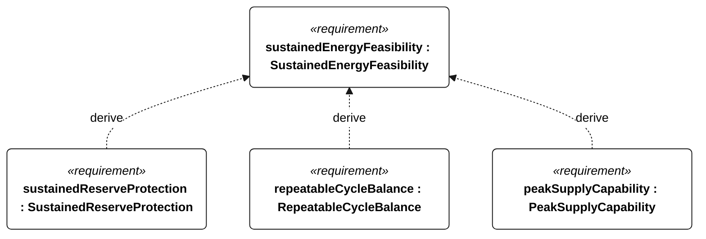
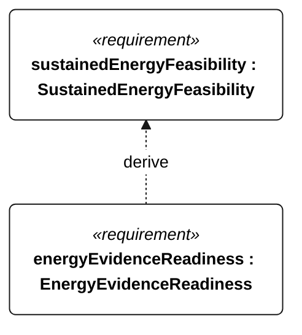

# E-200 sustained energy feasibility

[All requirement views](<../requirements-views.md>)

**SustainedEnergyFeasibility** — The installed energy architecture shall support the selected bounded repeating mission profile without external charging, while meeting the derived reserve, cycle-balance and peak-supply criteria. The 72-hour campaign is an initial energy demonstration, not proof of indefinite weather availability, functional performance or ocean readiness.

**SustainedReserveProtection** — Conservative stored energy shall remain strictly above the R-002 protected reserve throughout the selected sustained-operation profile. For piecewise-constant net power, check the initial state and every interval endpoint; unmodeled intrainterval dips are outside this claim.

**RepeatableCycleBalance** — Stored energy at the end of the complete repeating profile shall be at least its initial value at the same profile phase. This is a conditional repeatability criterion with fixed capacity, loads and resource bounds; it is not an indefinite endurance verdict.

**PeakSupplyCapability** — The battery supply shall support each selected mode's coincident peak withdrawal power without relying on harvesting. Load power shall include conversion losses and the declared uncertainty allowance.

**EnergyEvidenceReadiness** — An energy case shall be accepted as evidence-backed only after the installed-configuration load coverage, resource bounds, battery derating and interval-resolution evidence have been reviewed and accepted under the sustained-operations evidence checklist.

## E-200 derivation 1

## E-200 derivation 2

