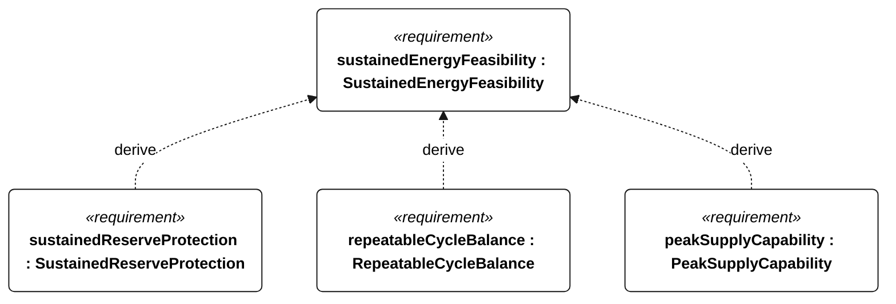
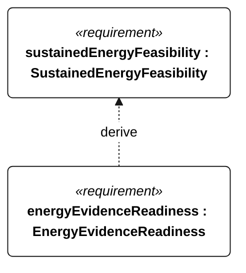

# E-200 SustainedEnergyFeasibility relationships

<!-- Generated from SysML by scripts/render_requirements.py; edit the model, not this file. -->

[All requirement views](<../requirements-views.md>)

[Conditions, rationale and verification](<../requirements-context.md>)

**E-200 SustainedEnergyFeasibility** — The installed energy architecture shall support the selected bounded repeating profile without external charging, meeting the derived reserve, cycle-balance and peak-supply criteria.

**E-201 SustainedReserveProtection** — Conservative stored energy shall remain strictly above the R-002 protected reserve throughout the selected sustained-operation profile.

**E-202 RepeatableCycleBalance** — Stored energy at the end of the complete repeating profile shall be at least its initial value at the same profile phase.

**E-203 PeakSupplyCapability** — The battery supply shall support each selected mode’s coincident peak withdrawal power without harvesting.

**E-205 EnergyEvidenceReadiness** — An energy case shall be accepted only after its installed-load coverage, resource bounds, battery derating and interval-resolution evidence have been accepted.

## E-200 relationships 1

## E-200 relationships 2

