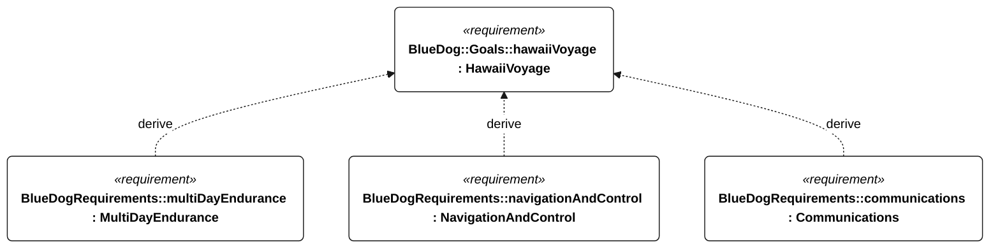
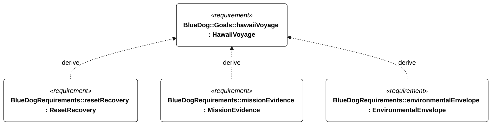
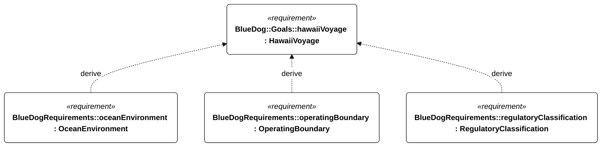
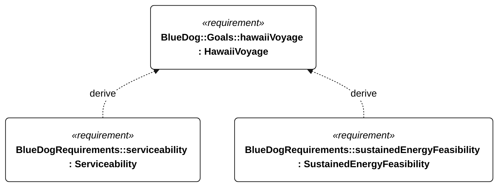

# H-001 hawaii voyage

[All requirement views](<../requirements-views.md>)

**HawaiiVoyage** — Develop SV Blue Dog toward completing an autonomous sailing voyage to Hawaii. The Gorge challenge is a proving ground for that end goal, not evidence of ocean readiness. Departure point, destination gate, route, duration, route/season suitability of the candidate ocean envelope, assistance/propulsion rules, and acceptance evidence remain to be agreed; Gorge-specific rules are not automatically ocean mission rules.

**MultiDayEndurance** — The vessel shall operate for 72 continuous hours without servicing or external charging while meeting the Gorge operational functions under N-010 and the applicable shared N-001 conditions. A qualification run shall include three consecutive 24-hour cycles, each with at most 6 hours of harvesting and at least 18 hours with harvesting disabled. Harvest input shall be limited to the installed harvester output measured under a frozen, recorded resource profile; a test supply may replay that profile but shall not exceed its measured power or accumulated energy. The conservative usable-energy estimate shall remain above the R-002 recovery reserve throughout. Acceptance requires the initial battery state, harvester configuration, replay profile, actual harvested energy and loads in the test record; absent profile evidence invalidates the test. Passing does not establish indefinite energy balance.

**NavigationAndControl** — Aggregate requirement for NavigationAndControl. Acceptance requires all applicable derived leaf results (E-105, E-106, E-107, E-108, E-109); this parent has no independent executable pass/fail predicate. Shared verification context: Qualification uses the selected mission profile. Accuracy trials contain 1800 scheduled one-second epochs in 30 minutes; invalid or missing epochs fail. Position and heading criteria use the same set of at least 1710 qualifying epochs, preventing separate selection of different good samples. Fault-injection runs are separate.

**Communications** — Aggregate requirement for Communications. Acceptance requires all applicable derived leaf results (E-120, E-121, E-122, E-123, E-124, E-131, E-137); this parent has no independent executable pass/fail predicate. Shared verification context: Link availability is a delivery-test precondition, not a coverage guarantee. Normal cadence is 60 seconds; low-energy alone permits 300 seconds; emergency/powered recovery takes precedence at 60 seconds. Outage tests last 24 hours.

**ResetRecovery** — Aggregate requirement for ResetRecovery. Acceptance requires all applicable derived leaf results (E-110, E-111, E-112, E-113, E-145, E-136, E-139, E-138, R-102, R-101); this parent has no independent executable pass/fail predicate. Shared verification context: Watchdog-reset tests start above protected reserve with valid navigation observations. Normal sailing remains subject to N-035; data and qualification persistence have shared leaf criteria.

**MissionEvidence** — Aggregate requirement for MissionEvidence. Acceptance requires all applicable derived leaf results (E-130, E-131, E-132, E-133, E-134, E-135, E-136, E-137, E-138, E-139); this parent has no independent executable pass/fail predicate. Shared verification context: Periodic records contain position, heading, mode, gate progress, battery energy and fault state. Critical events are independent of periodic cadence. Timestamp accuracy is assessed with valid GNSS time.

**EnvironmentalEnvelope** — The vessel shall retain the common environmental capabilities specified by the shared exposure requirements in both mission environments, with distinct operational and survival outcomes. Gorge acceptance uses N-010 and its profile leaves; ocean acceptance uses N-020 and its profile leaves. These mission-specific profiles are not interchangeable, and a Gorge release does not require ocean qualification. Qualification shall exercise navigation, sail/steering control, recording and available-link telemetry concurrently; survival acceptance permits loss of course progress but requires flotation, attached rig/ballast, dry electronics and retained mission state. Passing the Gorge profile alone shall not establish ocean capability.

**OceanEnvironment** — The vessel shall operate on a northeast Pacific passage toward Hawaii in saltwater, ocean swell, wind seas and prolonged unattended exposure. Ocean-derived parameter requirements and the shared exposure requirements apply together. The baseline is not a hurricane-survival claim or a completed route/season qualification.

**OperatingBoundary** — Aggregate requirement for OperatingBoundary. Acceptance requires all applicable derived leaf results (S-105, S-106, S-107, S-108, S-109); this parent has no independent executable pass/fail predicate. Shared verification context: Use uploaded permitted-water and exclusion polygons, with a 60-second prediction horizon. Inject approaches to every boundary, navigation loss and no-feasible-maneuver cases. Coordinates and uncertainty/clearance margins are controlled mission inputs with no default values.

**RegulatoryClassification** — Aggregate requirement for RegulatoryClassification. Acceptance requires all applicable derived leaf results (S-122, S-123); this parent has no independent executable pass/fail predicate. Shared verification context: Acceptance is deployment document review, not onboard behavior or an assertion of buoy status.

**Serviceability** — Aggregate requirement for Serviceability. Acceptance requires all applicable derived leaf results (P-107, P-108, P-109, P-110); this parent has no independent executable pass/fail predicate. Shared verification context: Exercise individual replacement of the battery, every electronics module, every actuator and every serviceable enclosure seal by one operator using hand tools.

**SustainedEnergyFeasibility** — The installed energy architecture shall support the selected bounded repeating mission profile without external charging, while meeting the derived reserve, cycle-balance and peak-supply criteria. The 72-hour campaign is an initial energy demonstration, not proof of indefinite weather availability, functional performance or ocean readiness.

## H-001 derivation 1

## H-001 derivation 2

## H-001 derivation 3

## H-001 derivation 4

[Continue: M-002 multi day endurance](<requirements-m-002.md>)

[Continue: E-002 navigation and control](<requirements-e-002.md>)

[Continue: E-005 communications](<requirements-e-005.md>)

[Continue: E-003 reset recovery](<requirements-e-003.md>)

[Continue: E-007 mission evidence](<requirements-e-007.md>)

[Continue: N-001 environmental envelope](<requirements-n-001.md>)

[Continue: N-020 ocean environment](<requirements-n-020.md>)

[Continue: S-002 operating boundary](<requirements-s-002.md>)

[Continue: S-005 regulatory classification](<requirements-s-005.md>)

[Continue: P-003 serviceability](<requirements-p-003.md>)

[Continue: E-200 sustained energy feasibility](<requirements-e-200.md>)
