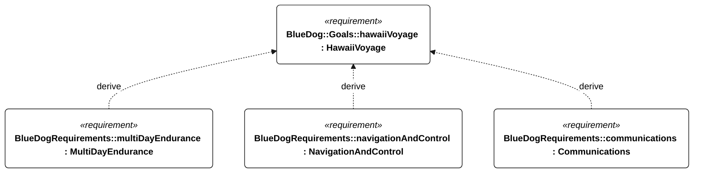
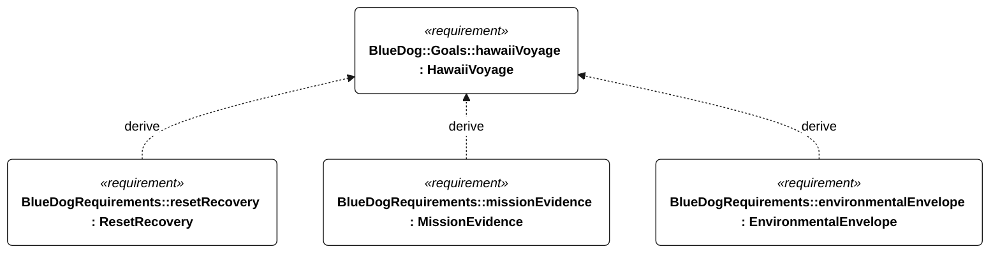
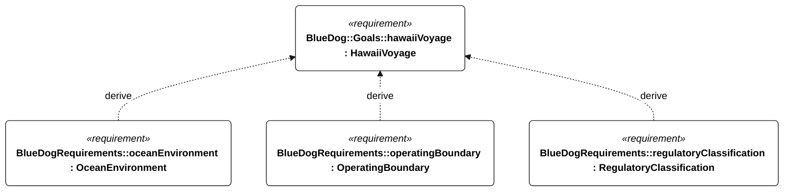
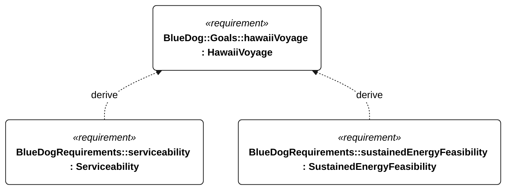

# H-001 hawaii voyage

[All requirement views](<../requirements-views.md>)

[Qualification conditions, rationale, open issues and verification](<../requirements-context.md>)

**H-001 HawaiiVoyage** — The vessel shall complete an autonomous sailing voyage to Hawaii.

**M-002 MultiDayEndurance** — The vessel shall operate for 72 continuous hours without servicing or external charging under the specified Gorge energy campaign.

**E-002 NavigationAndControl** — The vessel shall provide autonomous navigation and sail/steering control within the selected operational profile.

**E-005 Communications** — The vessel shall support live telemetry through link outages and reconnection.

**E-003 ResetRecovery** — The vessel shall restore mode-appropriate autonomous operation after a watchdog reset.

**E-007 MissionEvidence** — The vessel shall retain time-correlated mission evidence through communication and power interruptions.

**N-001 EnvironmentalEnvelope** — The vessel shall retain the functions required by its selected environmental profile and operating mode.

**N-020 OceanEnvironment** — The vessel shall operate on a northeast Pacific passage toward Hawaii amid saltwater, ocean swell, wind seas and prolonged unattended exposure.

**S-002 OperatingBoundary** — The vessel shall enforce the configured operating boundaries.

**S-005 RegulatoryClassification** — Deployment shall require documented compliance with applicable navigation, radio and authorization obligations.

**P-003 Serviceability** — The vessel shall support replacement of serviceable equipment without structural damage.

**E-200 SustainedEnergyFeasibility** — The installed energy architecture shall support the selected bounded repeating profile without external charging, meeting the derived reserve, cycle-balance and peak-supply criteria.

## H-001 derivation 1

## H-001 derivation 2

## H-001 derivation 3

## H-001 derivation 4

[Continue: M-002 multi day endurance](<requirements-m-002.md>)

[Continue: E-002 navigation and control](<requirements-e-002.md>)

[Continue: E-005 communications](<requirements-e-005.md>)

[Continue: E-003 reset recovery](<requirements-e-003.md>)

[Continue: E-007 mission evidence](<requirements-e-007.md>)

[Continue: N-001 environmental envelope](<requirements-n-001.md>)

[Continue: N-020 ocean environment](<requirements-n-020.md>)

[Continue: S-002 operating boundary](<requirements-s-002.md>)

[Continue: S-005 regulatory classification](<requirements-s-005.md>)

[Continue: P-003 serviceability](<requirements-p-003.md>)

[Continue: E-200 sustained energy feasibility](<requirements-e-200.md>)
