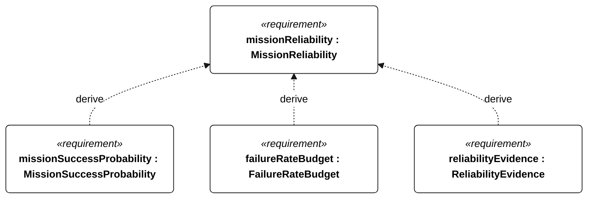
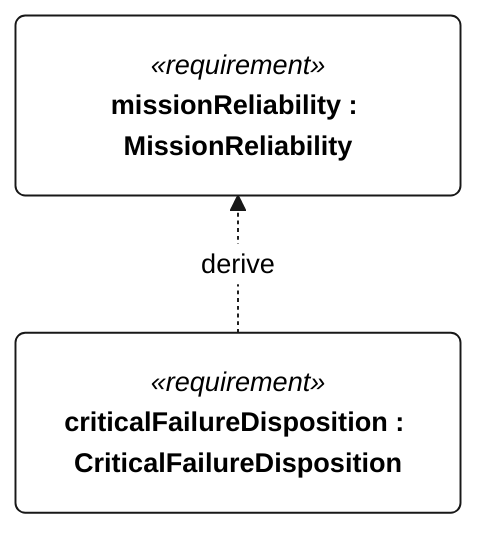

# L-001 MissionReliability

<!-- Generated from SysML by scripts/render_requirements.py; edit the model, not this file. -->

[All requirement views](<../requirements-views.md>)

[Qualification conditions, rationale, open issues and verification](<../requirements-context.md>)

**L-001 MissionReliability** — The vessel shall preserve mission-critical functions throughout each declared unassisted voyage.

**L-101 MissionSuccessProbability** — The lower 95-percent confidence bound on mission reliability shall be at least 0.90 over the declared voyage duration.

**L-102 FailureRateBudget** — The combined mission-critical failure-rate bound shall not exceed the budget derived from L-101 and the Q-102 exposure duration.

**L-103 ReliabilityEvidence** — The reliability assessment shall use accepted mission-representative evidence supporting its failure-rate bound.

**L-104 CriticalFailureDisposition** — Each identified safety-critical failure mode shall have an accepted disposition before an unassisted launch.

## L-001 derivation 1

## L-001 derivation 2

