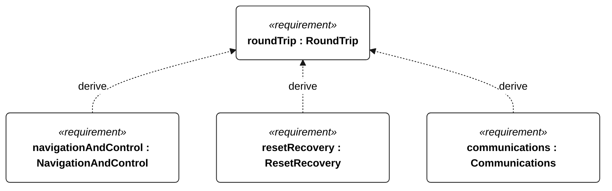
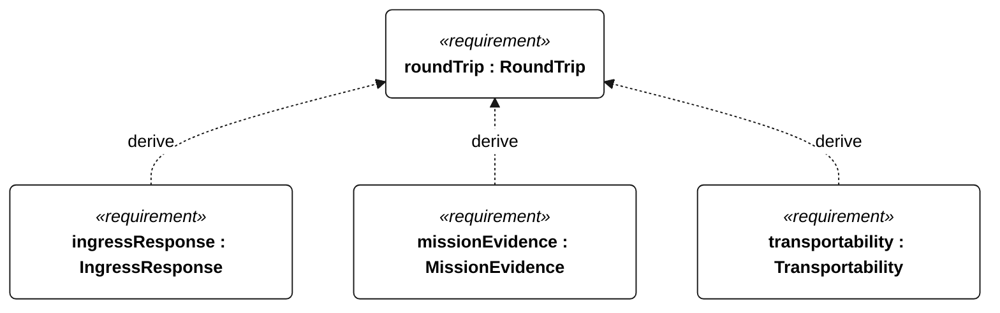
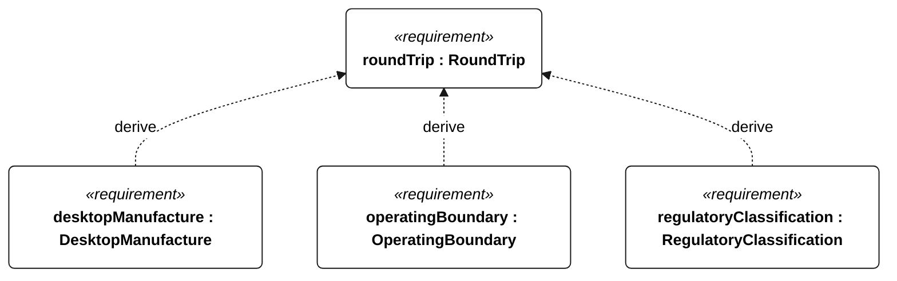
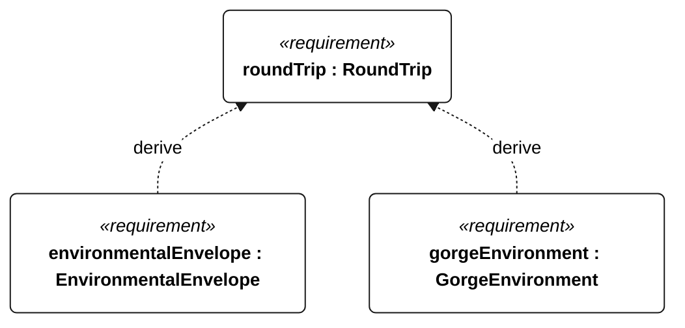
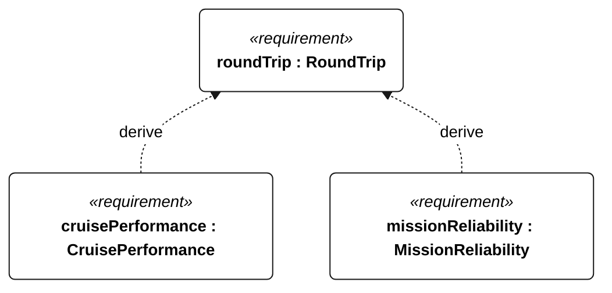

# M-001 round trip

[All requirement views](<../requirements-views.md>)

[Qualification conditions, rationale, open issues and verification](<../requirements-context.md>)

**M-001 RoundTrip** — The vessel shall cross the configured The Dalles departure, Bonneville turnaround and The Dalles return gates in order during one qualifying attempt.

**E-002 NavigationAndControl** — The vessel shall provide autonomous navigation and sail/steering control within the selected operational profile.

**E-003 ResetRecovery** — The vessel shall restore mode-appropriate autonomous operation after a watchdog reset.

**E-005 Communications** — The vessel shall support live telemetry through link outages and reconnection.

**E-006 IngressResponse** — The vessel shall retain recoverability during the specified hull-ingress qualification.

**E-007 MissionEvidence** — The vessel shall retain time-correlated mission evidence through communication and power interruptions.

**P-001 Transportability** — The vessel shall support transport, assembly, launch and retrieval by one adult under the specified handling conditions.

**P-002 DesktopManufacture** — Every print job shall fit within positive X, Y and Z extents no greater than 250 mm each.

**S-002 OperatingBoundary** — The vessel shall enforce the configured operating boundaries.

**S-005 RegulatoryClassification** — Deployment shall require documented compliance with applicable navigation, radio and authorization obligations.

**N-001 EnvironmentalEnvelope** — The vessel shall retain the functions required by its selected environmental profile and operating mode.

**N-010 GorgeEnvironment** — The vessel shall operate in the freshwater Columbia River reach between The Dalles and Bonneville, including opposing wind/current, short chop, traffic and submerged vegetation.

**Q-001 CruisePerformance** — The vessel shall sustain sailing performance sufficient to complete each declared unassisted mission route.

**L-001 MissionReliability** — The vessel shall preserve mission-critical functions throughout each declared unassisted voyage.

## M-001 derivation 1

## M-001 derivation 2

## M-001 derivation 3

## M-001 derivation 4

[Continue: E-002 navigation and control](<requirements-e-002.md>)

[Continue: E-003 reset recovery](<requirements-e-003.md>)

[Continue: E-005 communications](<requirements-e-005.md>)

[Continue: E-006 ingress response](<requirements-e-006.md>)

[Continue: E-007 mission evidence](<requirements-e-007.md>)

[Continue: P-001 transportability](<requirements-p-001.md>)

[Continue: S-002 operating boundary](<requirements-s-002.md>)

[Continue: S-005 regulatory classification](<requirements-s-005.md>)

[Continue: N-001 environmental envelope](<requirements-n-001.md>)

[Continue: N-010 gorge environment](<requirements-n-010.md>)

## M-001 derivation 5

[Continue: Q-001 cruisePerformance](<requirements-q-001.md>)

[Continue: L-001 missionReliability](<requirements-l-001.md>)
