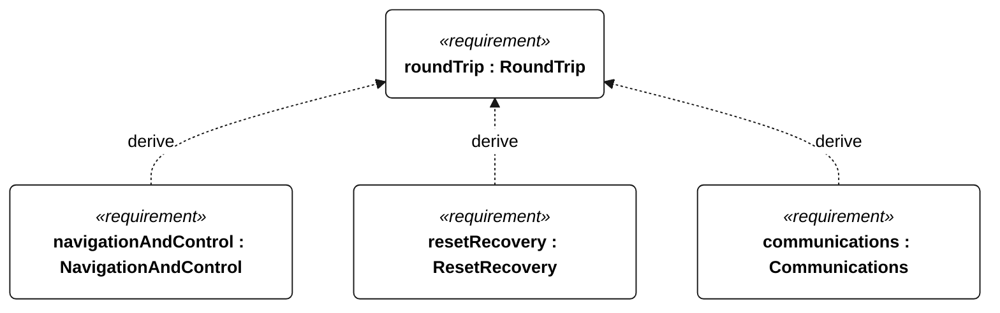
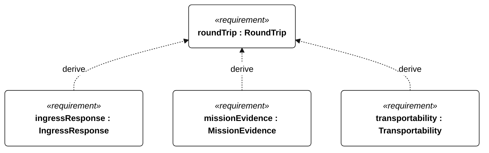
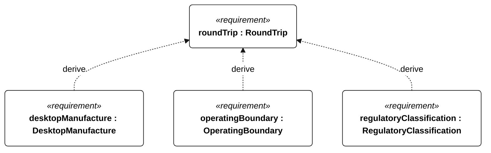
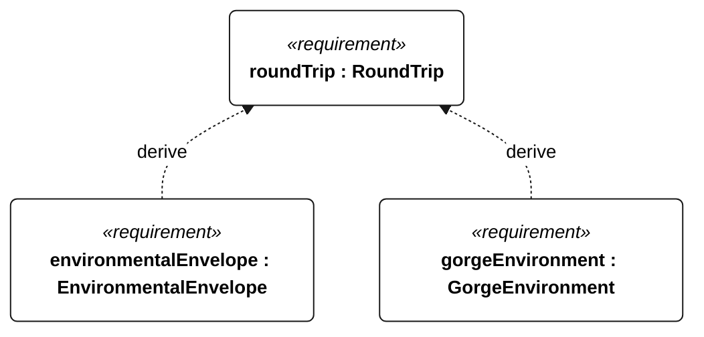

# M-001 round trip

[All requirement views](<../requirements-views.md>)

**RoundTrip** — The vessel shall cross the configured The Dalles departure gate, Bonneville turnaround gate and The Dalles return gate in that order during one attempt, satisfying C-003 through C-006. Acceptance shall use the timestamped trajectory and intervention/propulsion event log; a missing gate crossing or disqualifying event shall prevent a completion verdict.

**NavigationAndControl** — Aggregate requirement for NavigationAndControl. Acceptance requires all applicable derived leaf results (E-105, E-106, E-107, E-108, E-109); this parent has no independent executable pass/fail predicate. Shared verification context: Qualification uses the selected mission profile. Accuracy trials contain 1800 scheduled one-second epochs in 30 minutes; invalid or missing epochs fail. Position and heading criteria use the same set of at least 1710 qualifying epochs, preventing separate selection of different good samples. Fault-injection runs are separate.

**ResetRecovery** — Aggregate requirement for ResetRecovery. Acceptance requires all applicable derived leaf results (E-110, E-111, E-112, E-113, E-145, E-136, E-139, E-138, R-102, R-101); this parent has no independent executable pass/fail predicate. Shared verification context: Watchdog-reset tests start above protected reserve with valid navigation observations. Normal sailing remains subject to N-035; data and qualification persistence have shared leaf criteria.

**Communications** — Aggregate requirement for Communications. Acceptance requires all applicable derived leaf results (E-120, E-121, E-122, E-123, E-124, E-131, E-137); this parent has no independent executable pass/fail predicate. Shared verification context: Link availability is a delivery-test precondition, not a coverage guarantee. Normal cadence is 60 seconds; low-energy alone permits 300 seconds; emergency/powered recovery takes precedence at 60 seconds. Outage tests last 24 hours.

**IngressResponse** — Aggregate requirement for IngressResponse. Acceptance requires all applicable derived leaf results (E-125, E-126, E-127, E-128, E-129, E-144, E-132, R-101); this parent has no independent executable pass/fail predicate. Shared verification context: All leaves use a 30-minute freshwater injection at 10 mL/min into the normally dry hull. No pump technology is prescribed; R-004 remains applicable.

**MissionEvidence** — Aggregate requirement for MissionEvidence. Acceptance requires all applicable derived leaf results (E-130, E-131, E-132, E-133, E-134, E-135, E-136, E-137, E-138, E-139); this parent has no independent executable pass/fail predicate. Shared verification context: Periodic records contain position, heading, mode, gate progress, battery energy and fault state. Critical events are independent of periodic cadence. Timestamp accuracy is assessed with valid GNSS time.

**Transportability** — Aggregate requirement for Transportability. Acceptance requires all applicable derived leaf results (P-101, P-102, P-103, P-104, P-105, P-106); this parent has no independent executable pass/fail predicate. Shared verification context: Demonstrate with one adult, no powered lift, a firm bank or ramp of slope at most 1:12, wind at most 5 m/s and waves at most 0.2 m. This is not a survival-envelope recovery claim.

**DesktopManufacture** — Every printed component shall be producible as one or more print jobs on a printer with usable Cartesian travel of 250 mm by 250 mm by 250 mm. In the selected build orientation, the complete occupied envelope of each job, including supports, brim, raft and printer-required clearance, shall have positive X, Y and Z extents each no greater than 250 mm. Acceptance shall compare slicer/job-envelope measurements for every job with these limits; raw part volume alone is insufficient.

**OperatingBoundary** — Aggregate requirement for OperatingBoundary. Acceptance requires all applicable derived leaf results (S-105, S-106, S-107, S-108, S-109); this parent has no independent executable pass/fail predicate. Shared verification context: Use uploaded permitted-water and exclusion polygons, with a 60-second prediction horizon. Inject approaches to every boundary, navigation loss and no-feasible-maneuver cases. Coordinates and uncertainty/clearance margins are controlled mission inputs with no default values.

**RegulatoryClassification** — Aggregate requirement for RegulatoryClassification. Acceptance requires all applicable derived leaf results (S-122, S-123); this parent has no independent executable pass/fail predicate. Shared verification context: Acceptance is deployment document review, not onboard behavior or an assertion of buoy status.

**EnvironmentalEnvelope** — The vessel shall retain the common environmental capabilities specified by the shared exposure requirements in both mission environments, with distinct operational and survival outcomes. Gorge acceptance uses N-010 and its profile leaves; ocean acceptance uses N-020 and its profile leaves. These mission-specific profiles are not interchangeable, and a Gorge release does not require ocean qualification. Qualification shall exercise navigation, sail/steering control, recording and available-link telemetry concurrently; survival acceptance permits loss of course progress but requires flotation, attached rig/ballast, dry electronics and retained mission state. Passing the Gorge profile alone shall not establish ocean capability.

**GorgeEnvironment** — The vessel shall operate on the Columbia River reach between The Dalles and Bonneville in freshwater, opposing wind/current, short-period chop, traffic and submerged aquatic vegetation. Gorge-derived parameter requirements and the shared exposure requirements apply together; no dam transit, ice or surf-zone launch is included.

## M-001 derivation 1

## M-001 derivation 2

## M-001 derivation 3

## M-001 derivation 4

[Continue: E-002 navigation and control](<requirements-e-002.md>)

[Continue: E-003 reset recovery](<requirements-e-003.md>)

[Continue: E-005 communications](<requirements-e-005.md>)

[Continue: E-006 ingress response](<requirements-e-006.md>)

[Continue: E-007 mission evidence](<requirements-e-007.md>)

[Continue: P-001 transportability](<requirements-p-001.md>)

[Continue: S-002 operating boundary](<requirements-s-002.md>)

[Continue: S-005 regulatory classification](<requirements-s-005.md>)

[Continue: N-001 environmental envelope](<requirements-n-001.md>)

[Continue: N-010 gorge environment](<requirements-n-010.md>)
