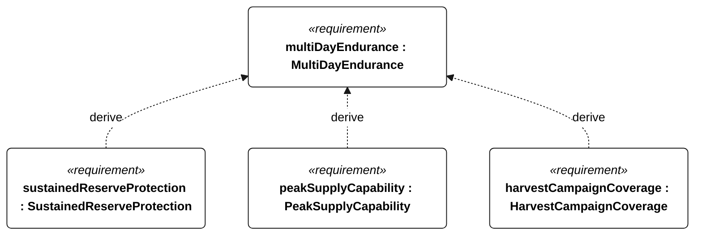
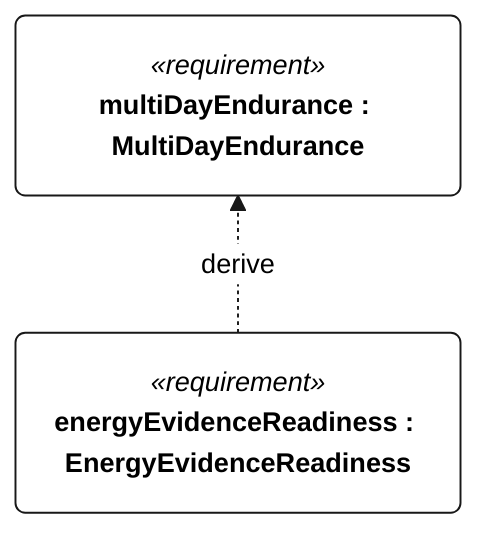

# M-002 MultiDayEndurance relationships

<!-- Generated from SysML by scripts/render_requirements.py; edit the model, not this file. -->

[All requirement views](<../requirements-views.md>)

[Conditions, rationale and verification](<../requirements-context.md>)

**M-002 MultiDayEndurance** — The vessel shall operate for 72 continuous hours without servicing or external charging under the specified Gorge energy campaign.

**E-201 SustainedReserveProtection** — Conservative stored energy shall remain strictly above the R-002 protected reserve throughout the selected sustained-operation profile.

**E-203 PeakSupplyCapability** — The battery supply shall support each selected mode’s coincident peak withdrawal power without harvesting.

**E-204 HarvestCampaignCoverage** — The qualification energy profile shall contain at least three consecutive 24-hour days, each with harvesting enabled for no more than 6 hours.

**E-205 EnergyEvidenceReadiness** — An energy case shall be accepted only after its installed-load coverage, resource bounds, battery derating and interval-resolution evidence have been accepted.

## M-002 relationships 1

## M-002 relationships 2

## Design decisions motivated by this requirement

Plain dependencies record design basis, not derivation or refinement. The native GeneralView renderer does not draw these dependencies; their actual endpoints and rationale are reported here.

| Dependent requirement | Design basis | Rationale |
| --- | --- | --- |
| energyAwareness | multiDayEndurance | Multi-day operation with variable harvesting needs energy estimation and load management. This is design motivation or an implementation choice, not a satisfaction implication. |
| lowEnergyRecovery | multiDayEndurance | Harvest shortfalls need an explicit degraded operating mode. This is design motivation or an implementation choice, not a satisfaction implication. |

[Continue: E-004 LowEnergyRecovery](<requirements-e-004.md>)

[Continue: E-001 EnergyAwareness](<requirements-e-001.md>)
